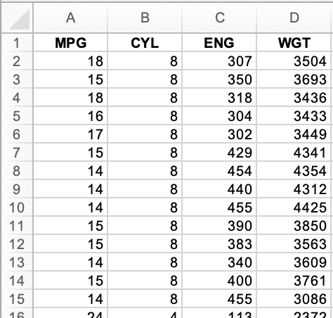

# Basic files lab

The goal of this lab is to get a basic familiarity with reading and writing text and binary files using Python. It's also an opportunity to use commandline arguments passed to Python scripts via `sys.argv`.

## Copying text files

Let's combine the code from the files lecture for both reading and writing text files to create a script that knows how to copy files from the command line. Of course, we would normally use `cp` from the commandline, but let's use Python so we can learn about reading and writing files.

So we have a text file to copy, download [prices.txt](https://raw.githubusercontent.com/parrt/msds501/master/data/prices.txt) from our course repository and save in a directory that you'd like to use for labs. Here's how you can create an appropriate directory from the commandline:

```bash
$ cd ~/classes/msds501
$ mkdir -p labs/files
$ cd labs/files
```
After saving the file you can check to ensure the file is in the appropriate directory:

```bash
$ ls
prices.txt
$ 
```

The goal here is to create a script that lets us copy files as follows.

```bash
$ python copytxt.py prices.txt /tmp/foo.txt
```

That command should copy the `prices.txt` file up into the `/tmp` directory.

To get started, create a Python script called `copytxt.py` in that same directory. The script should start out by getting the source and target file names from the commandline argument list:

```python
import sys

src = sys.argv[1]
trg = sys.argv[2]
```

Go back to the files lecture and type in code that will open the `src` file,  read in the contents to a string variable, then write that content back out to the `trg` file.

You can test your code by performing a copy and then using the `diff` command to compare the source and target files.

```bash
$ python copytxt.py prices.txt /tmp/foo.txt
$ diff prices.txt /tmp/foo.txt
$ 
```

We get no output from `diff`, indicating that there is no difference between the original file and the target.

## Copying any kind of file
 
[cars.xls](https://github.com/parrt/msds501/blob/master/data/cars.xls?raw=true)



```bash
$ python copytxt.py cars.xls /tmp/cars.xls
Traceback (most recent call last):
  File "copytxt.py", line 10, in <module>
    contents = f.read()
  File "/Users/parrt/opt/anaconda3/lib/python3.8/codecs.py", line 322, in decode
    (result, consumed) = self._buffer_decode(data, self.errors, final)
UnicodeDecodeError: 'utf-8' codec can't decode byte 0xd0 in position 0: invalid continuation byte
```