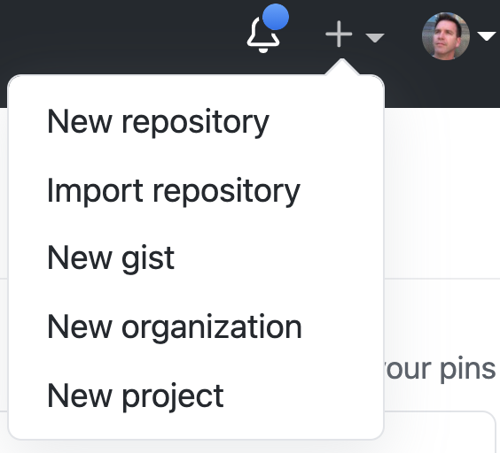
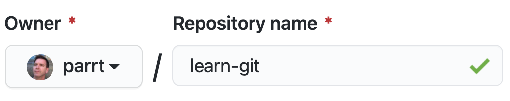
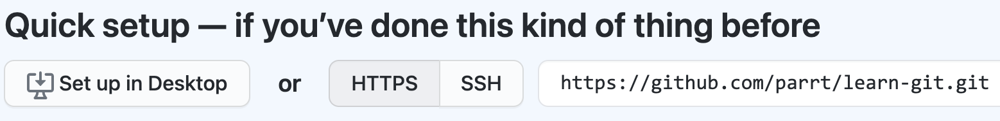
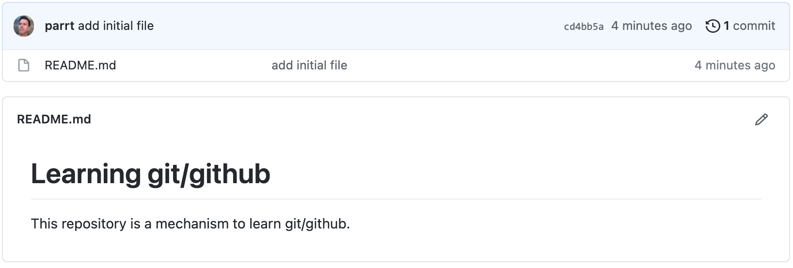

# Git and github lab

The goal of this lab is to learn the basics of creating a repository, making changes, and keeping github synchronized with your laptop.

## Setting up github

If you have not already done so, create an account at [github.com](github.com), making sure to choose a professional username that is suitable for your data science career. For example, do not choose a name like `hot4yourlove` or `lazyboy`. Make sure that you provide your github username to me.

Please do not change your github username during the program as grading scripts will then not see your code and you will get a zero for projects! If you must change it, please notify your instructor(s).

The first time you try to push something back to github, I think the use of git from the command line will ask you to configure your name and email address using the “git config” command with a bunch of options. Or, it looks like you can do this from github’s webpages; see [managing your commit email address](https://docs.github.com/en/github/setting-up-and-managing-your-github-user-account/managing-email-preferences/setting-your-commit-email-address).  That web update might be easier because the command line will ask you to use vi or some other editor you are unfamiliar with

## Creating a repository

Go to github and create a "New repository" using the menu in the upper right-hand corner of your github account:



Then on the "Create a new repository" page, create a suitable name for your repository such as:



This is just for testing so you can name it whatever you want.  Leave it as a public repository, rather than making it private. Then click the "Create repository" button, which will take you to a new page containing the following URL that you will need to clone the repo onto your laptop:



## Clone the github repository onto your laptop

At this point, github.com has created and is hosting a repository for you. There is nothing on our laptop associated with this repository nor is there a copy on our laptop.  Copy the HTTPS URL, that looks like `https://github.com/parrt/learn-git.git`, and now open up a terminal on your laptop. From the terminal, let's move to an appropriate directory on our laptop and give the command to clone the repository:

```bash
$ cd ~/classes/msds501
$ git clone https://github.com/parrt/learn-git.git
Cloning into 'learn-git'...
warning: You appear to have cloned an empty repository.
$ cd learn-git # jump inside the repository directory
```

You can verify that the repository on your disk is associated with the repo on github:

```bash
$ git remote -v
origin	https://github.com/parrt/learn-git.git (fetch)
origin	https://github.com/parrt/learn-git.git (push)
```

## Create and add a file to the repo

It's useful to have a `README.md` file in the root directory of the repository to tell people about the contents. Using your favorite text editor, or even just `nano` from the commandline, create `README.md` in the repository directory `~/classes/msds501/learn-git`. You can put what you want in there but you can use the following content (following [markdown format](https://guides.github.com/features/mastering-markdown)):

```
# Learning git/github

This repository is a mechanism to learn git/github.
```

The file exists now, but git does not know anything about it:

```bash
$ nano README.md
$ ls
README.md
$ git status
On branch master

No commits yet

Untracked files:
  (use "git add <file>..." to include in what will be committed)
	README.md

nothing added to commit but untracked files present (use "git add" to track)
$ 
```

So, let's tell git to start tracking that file:

```bash
$ git add README.md
$ git status
On branch master

No commits yet

Changes to be committed:
  (use "git rm --cached <file>..." to unstage)
	new file:   README.md
$ 
```

Git is now tracking that file but we have not commit our changes (we've not told git to take a snapshot), so let's do that now:

```bash
$ git commit -a -m 'add initial file'
[master (root-commit) cd4bb5a] add initial file
 1 file changed, 4 insertions(+)
 create mode 100644 README.md
$ 
```

## Getting changes back to github

Our goal now is to get this file mirrored back to github. First, let's verify that github still does not know about the local changes we've made with git on our disk. Got to your repo web page, mine is `https://github.com/parrt/learn-git`, and verify that the repo is still empty on github.

Back on your laptop in the terminal, tell git to push any changes (in this case, our new `README.md` file), to the remote repository at github:

```bash
$ git push origin
Enumerating objects: 3, done.
Counting objects: 100% (3/3), done.
Delta compression using up to 8 threads
Compressing objects: 100% (2/2), done.
Writing objects: 100% (3/3), 270 bytes | 270.00 KiB/s, done.
Total 3 (delta 0), reused 0 (delta 0), pack-reused 0
To https://github.com/parrt/learn-git.git
 * [new branch]      master -> master
$ 
```

In your case, it will probably ask you for your username at github and password (but I have it set up so it doesn't need to ask me passwords all the time).

Refresh your github repository page and you should see that there is content now. Mine looks like this:



By convention, github knows to display/render any `README.md` file as the description of the repository.

## Editing on github and pulling down to your laptop

On your github repository page, click the little pencil to edit the `README.md` file and make some simple changes. For example, I added a line that says "Changes made on github." Then, click the "Commit changes" button at the bottom of the page. It will take you back to the repository homepage and you should see your changes.

On the terminal of your laptop, verify that your laptop does not have those changes:

```bash
$ cat README.md 
# Learning git/github

This repository is a mechanism to learn git/github.
```

To synchronize your laptop with the github repository, pull changes down:

```bash
$ git pull origin
remote: Enumerating objects: 5, done.
remote: Counting objects: 100% (5/5), done.
remote: Compressing objects: 100% (2/2), done.
remote: Total 3 (delta 1), reused 0 (delta 0), pack-reused 0
Unpacking objects: 100% (3/3), 666 bytes | 222.00 KiB/s, done.
From https://github.com/parrt/learn-git
   cd4bb5a..56359ea  master     -> origin/master
Updating cd4bb5a..56359ea
Fast-forward
 README.md | 1 +
 1 file changed, 1 insertion(+)
$ 
```

Then, you should see that your local file has been updated:

```bash
$ cat README.md 
# Learning git/github

This repository is a mechanism to learn git/github.

Changes made on github.
```

Congratulations! You are well on your way to understanding how git and github work!!!