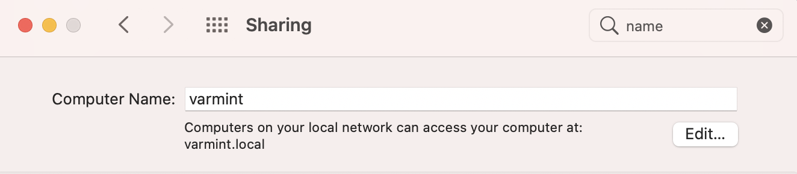
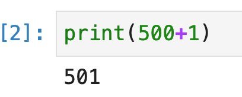

# A first taste of Python tools

The goal of this lab is to get a taste of the commandline, make sure that you can execute Python scripts, and start using Jupyter notebooks. You can also check out chapter [Development Tools](https://mlbook.explained.ai/tools.html) from [The mechanics of machine learning](https://mlbook.explained.ai).   

You should just work through the examples, typing what you see to get a feel for the commands and Python programming ecosystem.  It will often be the case that we work through code together in class and you need to be able to quickly start an environment where you can write and execute code.

## Let's set up your machine name 

If you did not set up a machine name, then Mac OS probably set it up with some weird name based upon your human name. As you can see, my work machine is called `varmint`:



## Launch a commandline app

Launch `Terminal.app` (Mac) or whatever the `bash` or `zsh` *terminal*, *shell*, or *commandline prompt* program is on your flavor of UNIX. You should see a blinking cursor and a `$` prompt, possibly with the current working directory to the left of the `$` prompt:

```bash
$ 
```

The `$` sign above is just the prompt that indicates the terminal is waiting for you to type something. After command executes, you will see the `$` prompt again.

The commandline is a very low-level interface for communicating with the operating system of your computer. You can think of the terminal as the diagnostics computer that mechanics plug into your car to really take control. A car's dashboard is analogous to the windowing graphical interface we use most of the time.  Becoming a programmer is like becoming a mechanic; sometimes you need more powerful but more complicated tools to operate machinery.

You should more or less always have a command shell running in case you need to do something low-level. The first thing a mechanic does when he or she starts to work is to connect the diagnostic computer. So should you.

The command line is actually a full programming language with loops and everything but most of the time we simply execute commands. Commands have arguments just like function calls in a programming language have arguments. Here's how to say hello from the command line:

```bash
$ echo "hello"
hello
$ 
```

The `echo` command is analogous to the `print` command in Python code. 

Give it a try!  Type `echo "hello"` followed by newline (return key). All commands are terminated by hitting the return key.  After executing the command, the prompt returns indicating you can type another command. 

There are lots of things we can do; here's another one:

```bash
$ date
Wed Jul 12 14:18:51 PDT 2017
```

We can pass an argument (like a function call in Python) to commands:

```bash
$ date "+%Y-%m-%d"
2018-07-08
```

### Installing terminal software

To install most free software on the Mac, we use use a program called [homebrew](https://brew.sh/) (just `brew` from the command line). It might be preinstalled on your computer, but if not, read the instructions and install it. It's a matter of cutting and pasting a single line that starts with `/usr/bin/ruby...`

The software `brew` installs is typically then available as a command from the commandline. For example, let's install `mpg123`, needed by our sound file lab.  In might be the case that your computer already has this installed, but let's run the install anyway:

```bash
$ brew install mpg123
==> Downloading https://ghcr.io/v2/homebrew/core/mpg123/manifests/1.28.0
Already downloaded: /Users/parrt/Library/Caches/Homebrew/downloads/5ed0674621da9c4a6a486f685e7122862b5e4276db02130ebbf346f374fdc943--mpg123-1.28.0.bottle_manifest.json
==> Downloading https://ghcr.io/v2/homebrew/core/mpg123/blobs/sha256:2f69c200c93039
Already downloaded: /Users/parrt/Library/Caches/Homebrew/downloads/8f408941becd57515ec89105026ff143151b773bc2e58de4d2368b40b4f8b43b--mpg123--1.28.0.big_sur.bottle.tar.gz
==> Pouring mpg123--1.28.0.big_sur.bottle.tar.gz
🍺  /usr/local/Cellar/mpg123/1.28.0: 30 files, 1.3MB
$ 
```

Then you can try out the `mpg123` command to make sure it installed:

```bash
$ mpg123
You made some mistake in program usage... let me briefly remind you:

High Performance MPEG 1.0/2.0/2.5 Audio Player for Layers 1, 2 and 3
	version 1.28.0; written and copyright by Michael Hipp and others
	free software (LGPL) without any warranty but with best wishes

usage: mpg123 [option(s)] [file(s) | URL(s) | -]
...
```

### Installing Python software

We will also install a lot of Python packages, for which we use the `pip` command.  For example, we will need `pysoundfile` and `sounddevice`:

```bash
$ pip install pysoundfile
...
$ pip install sounddevice
...
$ 
```

## Environment Sanity check

From the command line, type in the following command to verify that you have access to `python3`:
 
```bash
$ which python3
/Users/parrt/opt/anaconda3/bin/python
```

Or, better yet, make sure the default Python is version 3:

```bash
$ which python
/Users/parrt/opt/anaconda3/bin/python
```

The Python program should be in the Anaconda `bin` (binary) directory, that holds all of the binary executables. If you don't see anaconda somewhere in the output from the `which` command, you need to look at the documentation for Anaconda and figure out why you are not running the appropriate Python. (Most likely something is wrong with your shell's `PATH` environment variable.) That's okay for now as we can use any available 3.X version of Python.

Next, run the program and make sure you have a recent version like 3.8:

```bash
$ python
Python 3.8.8 (default, Apr 13 2021, 12:59:45) 
[Clang 10.0.0 ] :: Anaconda, Inc. on darwin
Type "help", "copyright", "credits" or "license" for more information.
>>> 
```

Next try importing a library:

```bash
$ python
Python 3.8.8 (default, Apr 13 2021, 12:59:45) 
[Clang 10.0.0 ] :: Anaconda, Inc. on darwin
Type "help", "copyright", "credits" or "license" for more information.
>>> import pandas as pd
>>> 
```

You should not get an error.

##  Interactive Python

Now let's jump into an interactive Python shell. In the abstract, it's the same as the command shell that controls your computer.  Both are programming languages; they just have different specialties. When we jump from the terminal shell into Python's shell, it's like jumping across the border from France into Germany. We have to stop speaking French and start speaking German.  When you exit the Python interpreter, you will be back in the terminal world, just as if you had returned from Germany to France.

To enter the Python world, from the terminal `$` prompt type `python` as we did in the last section. You should see that it is using the **Anaconda** version. If not, that means you are using the default Python on your system.

Now, from the Python prompt ">>>" (we are no longer in the terminal), type `500+1` followed by newline. You should see something like this:

```python
$ python
Python 3.8.8 (default, Apr 13 2021, 12:59:45) 
[Clang 10.0.0 ] :: Anaconda, Inc. on darwin
Type "help", "copyright", "credits" or "license" for more information.
>>> 500+1
501
>>> 
```

Python has evaluated the expression and printed the result back to the screen. It is as if we had used a `print` function call, which gives us the same result:

```python
>>> print(500+1)
501
```

The Python interactive shell prints expression values immediately, but that is not the case when running a program as a script (i.e., not interactively).

To exit the interactive shell and go back to the command line (the terminal program), say `quit()` (or control-D) and hit return:

```bash
>>> quit()
$ 
```

The `$` prompt indicates that you are back at the command line. You can no longer type python code and the computer is expecting a terminal shell command.

## Scripting Python

Go to a suitable directory (folder) on your disk, or create one, such as `/Users/YOURUSERNAME/classes/msds501/inclass`.

```bash
$ cd ~   # set current working directory to your home directory
$ mkdir -p classes/msds501/inclass  # make this subdirectory path
$ cd classes/msds501/inclass   # set working directory to inclass
```

(**Do not use spaces in any of your directory or file names...ever!**) Now create a **text file** called `hello.py` in that directory that contains exactly one line:

```python
500+1
```

Use the editor of your choice, though `nano` is a good one because you will be able to use it on remote servers when we do cloud computing. You can start it up like this:

```bash
$ nano hello.py
```

Sublime and TextEdit.app also work. Do not use Microsoft Word or other work processors because they do not create raw text files; they have formatting commands in there as well that Python doesn't know how to handle.

That `500+1` expression line is exactly what you typed in first in the interactive Python shell. Save the file into your `inclass` directory or whatever you're calling it.

Once you get the Python file written to the disk using your editor, make sure you are in the directory containing the `hello.py` file using `cd` (change directory) from the commandline:

```bash
$ cd ~/classes/msds501/inclass
```

(`~` is a shorthand for "home directory"). Use `ls` to get a directory listing:

```bash
$ ls
hello.py
```

You can verify that you have created the Python script properly by typing the following at the command line:

```bash
$ cat hello.py
500+1
$ 
```

Here are solutions to the most common errors:

1. Do not put `.txt` at the end of the file name; it must be `.py`
2. Do NOT use M$ Word or any other word processor; You think it's text but it's not. There are lots of text editors out there including Mac's `TextEdit.app`. Just make sure save as plain text not "rich text". There are also plenty of text editor such as [Sublime](https://www.sublimetext.com/) and [TextMate](https://macromates.com/).  (If you are really hard-core, you will learn `vi` or `emacs`, which you will see me use in class.) You can also use `nano` from the command line for editing directly in the command line window.

Now, let's run that program/script:

```bash
$ python hello.py
$ 
```

We do not get any output. This is a critical difference to internalize. The interactive Python shell immediately prints expression values because it is interactive. When you run a file from the commandline, it assumes you wanted to execute the code like a script in batch mode. That is why we do not get any output without a print statement.

Now edit that file and change it to

```python
print(500+1)
```

Save the file and rerun it. Now you should see:

```bash
$ python hello.py 
501
$ 
```

Because we have explicitly asked the program to emit output, we see output.

## Jupyter notebooks (via Jupyter Lab)

Now, we're going to do the exact same thing except using the Jupyter Lab browser-based environment.  Launch Jupyter from the command line (and not by double-clicking on something from the Anaconda GUI):

```bash
$ jupyter lab
[I 2021-06-16 17:00:21.330 ServerApp] jupyterlab | extension was successfully linked.
[I 2021-06-16 17:00:21.869 ServerApp] jupyter_nbextensions_configurator | extension was found and enabled by nbclassic. Consider moving the extension to Jupyter Server's extension paths.
[I 2021-06-16 17:00:21.870 ServerApp] jupyter_nbextensions_configurator | extension was successfully linked.
[I 2021-06-16 17:00:21.870 ServerApp] nbclassic | extension was successfully linked.
...
```

That will start up a program that also opens a new tab in your browser:


Clicking on the "Python 3" icon under the "Notebook" category creates a new notebook window for you:


Type `500+1` into the first cell next to the `In [ ]`. You should see the output 501 generated in the `Out` section below it. Hit control-enter to execute that cell or the right-facing triangle in the toolbar to execute the cell.

This is an interactive environment and so you can go back and edit the `500+1` to be, say, `print(500+1)`. Do that and then hit control-enter again to run. You should get the same output:



**You should be able to test out small programs or Python snippets very very quickly. Rehearse these procedures until they are second nature.**