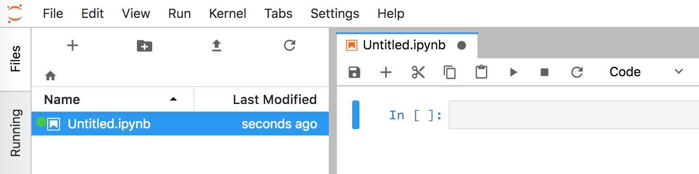

# A first taste of Python tools

## Launch a commandline app

Launch `Terminal.app` (Mac) or whatever the `bash` *terminal*, *shell*, or *commandline prompt* program is on your flavor of UNIX. You should see a blinking cursor and a `$` prompt:

```bash
$ 
```

The `$` sign above is just the prompt that indicates the terminal is waiting for you to type something. After command executes, you will see the `$` prompt again.

The commandline is a very low-level interface for communicating with the operating system of your computer. You can think of the terminal as the diagnostics computer that mechanics plug into your car to really take control. The dashboard is analogous to the windowing graphical interface we use most of the time.  Becoming a programmer is like becoming a mechanic; sometimes you need more powerful but more complicated tools to operate machinery.

You should more or less always have a command shell running in case you need to do something low-level. The first thing a mechanic does when he or she starts to work is to connect the diagnostic computer. So should you.

The command line is actually a full programming language with loops and everything but most of the time we simply execute commands. Commands have arguments just like function calls in a programming language have arguments. Here's how to say hello from the command line:

```bash
$ echo "hello"
hello
$ 
```

Commands are terminated by hitting the return key.  

The `echo` command is analogous to the `print` command in Python code. 

After executing the command, the prompt returns indicating you can type another command. 

There are lots of things we can do; here's another one:

```bash
$ date
Wed Jul 12 14:18:51 PDT 2017
```

We can pass an argument (like a function call in Python) to commands:

```bash
$ date "+%Y-%m-%d"
2018-07-08
```

Here's a cool example of a loop from the command line to examine all `.md` files (you don't need to run this one as part of the lab; I'm just showing off here):

```bash
$ for f in *.md; do echo $f; done
aws.md
bash-intro.md
combinations.md
complexity.md
computation.md
data-in-memory.md
data.md
files.md
git.md
operations.md
planning.md
programming.md
reading-code.md
sqrt.md
```


## Environment Sanity check

From the command line, type in the following command to verify that you have access to `python3`:
 
```bash
$ which python3
/Users/parrt/anaconda3/bin/python3
```

Or, better yet, make sure the default Python is version 3:

```bash
$ which python
/Users/parrt/anaconda3/bin/python
```

The Python program should be in the Anaconda `bin` (binary) directory, that holds all of the binary executables. If you don't see anaconda somewhere in the output from the `which` command, you need to look at the documentation for Anaconda and figure out why you are not running the appropriate Python. (Most likely something is wrong with your `PATH` environment variable.) That's okay for now as we can use any 3.X version of Python running.

Next, run the program and make sure you have a recent version like 3.6.5:

```bash
$ python
Python 3.6.5 | packaged by conda-forge | (default, Mar 30 2018, 00:00:55) 
[GCC 4.2.1 Compatible Apple LLVM 6.1.0 (clang-602.0.53)] on darwin
Type "help", "copyright", "credits" or "license" for more information.
>>> 
```

Next try importing a library:

```bash
$ python
Python 3.6.5 | packaged by conda-forge | (default, Mar 30 2018, 00:00:55) 
[GCC 4.2.1 Compatible Apple LLVM 6.1.0 (clang-602.0.53)] on darwin
Type "help", "copyright", "credits" or "license" for more information.
>>> import pandas as pd
>>> 
```

You should not get an error.

See also [Computer environment sanity check](https://mlbook.explained.ai/intro.html#sec:2.2.1) from my book [The mechanics of machine learning](https://mlbook.explained.ai).

##  Interactive Python

Now let's jump into an interactive Python shell. In the abstract, it's the same as the bash command shell that controls your computer.  Both are programming languages; they just have different specialties. When we jump from the bash shell into Python's shell, it's like jumping across the border from France into Germany. We have to stop speaking French and start speaking German. (Or, keep speaking English if you're American because we're lazy and don't know any foreign languages. haha)  When you exit the Python interpreter, you will be back in the bash world, just as if you had returned from Germany to France.

To enter the Python world, from the bash `$` prompt type `python` as we did in the last section. You should see that it is using the **Anaconda** version. If not, that means you are using the default Python on your system.

Now, from the Python prompt ">>>" (we are no longer in `bash`), type `500+1` followed by newline. You should see something like this:

```python
$ python
Python 3.6.5 |Anaconda, Inc.| (default, Apr 26 2018, 08:42:37) 
[GCC 4.2.1 Compatible Clang 4.0.1 (tags/RELEASE_401/final)] on darwin
Type "help", "copyright", "credits" or "license" for more information.
>>> 500+1
501
>>> 
```

Python has evaluated the expression and printed the result back to the screen. It is as if we had used a `print` function call, which gives us the same result:

```python
>>> print(500+1)
501
```

The Python interactive shell prints expression values immediately, but that is not the case when running a program as a script (i.e., not interactively).

To exit the interactive shell and go back to the command line (the terminal program), say `quit()` (or control-D) and hit return:

```bash
>>> quit()
$ 
```

The `$` prompt indicates that you are back at the bash command line. You can no longer type python code.

## Scripting Python

Go to a suitable directory (folder) on your disk, or create one, such as `/Users/YOURID/msan501/inclass`. (**Do not use spaces in any of your directory or file names...ever!**) Now create a **text file** called `hello.py` in that directory that contains exactly one line:

```python
500+1
```

Use the editor of your choice, though `nano` is a good one because you will be able to use it on remote servers when we do cloud computing. Sublime and TextEdit.app also work.

That "code" is exactly what you typed in first in the interactive Python shell. Save the file in your `inclass` directory or whatever your calling.

Once you get the Python file written to the disk using your editor, you should be able to jump to that directory using `cd` (change directory) from the commandline:

```bash
$ cd /Users/YOURID/msan501/inclass
```

Use `ls` to get a directory listing:

```bash
$ ls
hello.py
```

You verify that you have created the Python script properly by typing the following at the command line:

```bash
$ cat hello.py
500+1
$ 
```

Here are solutions to the most common errors:

1. Do not put `.txt` at the end of the file name; it must be `.py`
2. Do NOT use M$ Word or any other word processor; You think it's text but it's not. There are lots of text editors out there including Mac's `TextEdit.app`. Just make sure save as plain text not "rich text". There are also plenty of text editor such as [Sublime](https://www.sublimetext.com/) and [TextMate](https://macromates.com/).  (If you are really hard-core, you will learn `vi` or `emacs`, which you will see me use in class.) You can also use `nano` from the command line for editing directly in the command line window.

Now, we're going to run that program/script:

```bash
$ python hello.py
$ 
```

We do not get any output. This is a critical difference. The interactive Python shell immediately prints expression values because it is interactive. When you run a file from the commandline, it assumes you wanted to execute the code like a script in batch mode. That is why we do not get any output without a print statement.

Now edit that file and change it to

```python
print(500+1)
```

Save the file and rerun it. Now you should see:

```bash
$ python hello.py 
501
$ 
```

## Jupyter notebooks (via Jupyter Lab)

Now, we're going to do the exact same thing except using the Jupyter Lab browser-based environment.  (See [Your machine learning development environment](https://mlbook.explained.ai/prep.html#sec:3.1) from the [in-progress ML book](https://mlbook.explained.ai) for more.)

Launch Jupyter from the command line::

```bash
$ jupyter lab
I 11:27:00.606 LabApp] [jupyter_nbextensions_configurator] enabled 0.2.8
[I 11:27:00.613 LabApp] JupyterLab beta preview extension loaded from /Users/parrt/anaconda3/lib/python3.6/site-packages/jupyterlab
[I 11:27:00.613 LabApp] JupyterLab application directory is /Users/parrt/anaconda3/share/jupyter/lab
[W 11:27:00.616 LabApp] JupyterLab server extension not enabled, manually loading...
...
```

That will start up a program that launches a tab in your browser as well:


Clicking on the "Python 3" icon under the "Notebook" category creates a new notebook window for you:



Type `500+1` into the first cell next to the `In [ ]`. You should see the output 501 generated in the `Out` section below it. Hit control-enter to execute that cell or the right-facing triangle in the toolbar to execute the cell.

This is an interactive environment and so you can go back and edit the `500+1` to be, say, `print(500+1)`. Do that and then hit control-enter again to run. You should get the same output.

**You should be able to test out small programs or Python snippets very very quickly. Rehearse these procedures until they are second nature.**