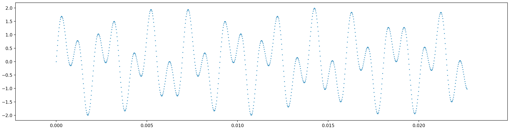

# Playing sounds

The goal of this lab is to amaze yourself that you can do some audio file processing with Python. You won't get all the details, but you can cut-and-paste for this lab to start conversing in Python.  As a secondary goal, you'll get used to installing Python packages and commandline tools.

First, download the following two audio files so we have some raw materials to work with.

* [initial sequence from Kiss by Prince, Kiss.aiff](../notes/sound/Kiss.aiff)
* [ahhh sound, ahhh.mp3](../notes/sound/ahhh.mp3)

I suggests that you store them in a directory such as:

`/Users/YOURID/msan501/labs/sound`

where `YOURID` is your computer login name. For example, my login name is `parrt`. On Linux it would something like:

`/home/YOURID/msan501/labs/sound`

## Installing commandline tools

It turns out that the sound libraries we're going to use in Python don't know how to process mp3 files. We need to convert the ahhh.mp3 file to ahhh.wav, which the libraries do know how to process. To do that, were going to use a tool called [mpg123](https://www.mpg123.de/).

To install most free software on the Mac, we use use a program called [homebrew](https://brew.sh/) (just `brew` from the command line). It might be preinstalled on your computer, but if not, read the instructions and install it. It's a matter of cutting and pasting a single line that starts with `/usr/bin/ruby...`

Once that's installed, we can use it to install `mpg123`. From the terminal, run the following `brew` command, which should give the indicated output:

```bash
$ brew install mpg123
...
==> Downloading https://homebrew.bintray.com/bottles/mpg123-1.25.0.el_capitan.bottle.tar.gz
######################################################################## 100.0%
==> Pouring mpg123-1.25.0.el_capitan.bottle.tar.gz
==> Using the sandbox
🍺  /usr/local/Cellar/mpg123/1.25.0: 26 files, 765.2KB
```

On Linux, installation of mpg123 is either:

```bash
sudo apt-get install mpg123
```

or

```bash
$ sudo yum install mpg123
```

## Converting mp3 to wav files

Now, that we have mpg123 installed, we can use it to convert an .mp3 to a .wav file. Go into the directory where you have saved the `ahhh.mp3` file using the `cd` (change directory) command and list at the files with `ls`:

```bash
$ cd /Users/YOURID/msan501/labs/sound
$ ls
Kiss.aiff  ahhh.mp3
```

Use following command to convert the file:

```bash
$ mpg123 -w ahhh.wav ahhh.mp3 
High Performance MPEG 1.0/2.0/2.5 Audio Player for Layers 1, 2 and 3
	version 1.25.0; written and copyright by Michael Hipp and others
	free software (LGPL) without any warranty but with best wishes


Terminal control enabled, press 'h' for listing of keys and functions.

Playing MPEG stream 1 of 1: ahhh.mp3 ...

MPEG 1.0 L III cbr192 44100 j-s

Comment:  00000000 00000210 000009F5 000000000004FF7B 00000000 0002AB44 00000000 00000000 00000000 00000000 00000000 00000000

[0:07] Decoding of ahhh.mp3 finished.
```

There's a lot of gibberish in that output that we don't care about but make sure that it says "finished" and it doesn't look like there are any errors. Take a look at the files in the current directory and see if ahhh.wav appears:

```bash
$ ls
Kiss.aiff  ahhh.mp3   ahhh.wav 
```

If you can't figure out how to convert to `ahhh.wav`, don't worry about it. You can just [download it from my notes](../notes/sound/ahhh.wav).

At this point, we've learned to jump around to different locations in the file system using `cd` and used `ls` to list the files in a directory. We use `brew` as our install command for non-Python packages.

## Installing Python packages

In order to read and play sound files from Python, we need to leverage some existing Python code. Code is typically delivered in bundles called *libraries* or *packages*; the terms are more or less used synonymously in practice.

* For reading sound files, we need [pysoundfile](http://pysoundfile.readthedocs.io/en/0.9.0/)
* For playing sounds, we need [sounddevice](http://python-sounddevice.readthedocs.io/en/0.3.7/)

If we try to use packages before installing them, the Python executor shows us errors like the following.
 
```bash
---------------------------------------------------------------------------
ImportError                               Traceback (most recent call last)
<ipython-input-61-b5992dda2a80> in <module>()
----> 1 import soundfile as sf

ImportError: No module named soundfile
```

The key is that at the `import` statement, we get the error `No module named soundfile`.  That shouldn't wreck your day--it just means we have to install that package.

To install Python packages, we use the `pip` (or, later, `conda`) program. Normally this program does what we want quickly and easily, but a number of things can go wrong. The most common is that your `pip` program does not match up with the `python` program. First verify that they appear to be coming from the same `bin` directory using `which`:

```bash
$ which pip
/Users/parrt/anaconda3/bin/pip
$ which python
/Users/parrt/anaconda3/bin/python
$ which python3
/Users/parrt/anaconda3/bin/python3
```

Now, let's install the `pysoundfile` package:

```bash
$ pip install pysoundfile
Collecting pysoundfile
  Downloading PySoundFile-0.9.0.post1-py2.py3.cp26.cp27.cp32.cp33.cp34.cp35.cp36.pp27.pp32.pp33-none-macosx_10_5_x86_64.macosx_10_6_intel.macosx_10_9_intel.macosx_10_9_x86_64.whl (573kB)
    100% |████████████████████████████████| 573kB 1.4MB/s 
Requirement already satisfied: cffi>=0.6 in /Users/parrt/anaconda2/lib/python2.7/site-packages (from pysoundfile)
Requirement already satisfied: pycparser in /Users/parrt/anaconda2/lib/python2.7/site-packages (from cffi>=0.6->pysoundfile)
Installing collected packages: pysoundfile
Successfully installed pysoundfile-0.9.0.post1
```

**LINUX USERS:** You need to do `conda install libgcc` as well to make this sound stuff work.

Install the other package as well:

```bash
$ pip install sounddevice
Collecting sounddevice
...
```

To make sure that we have installed the packages properly, we can try importing them with the interactive Python shell `python` or `ipython`:

```bash
$ python
Python 3.6.5 | packaged by conda-forge | (default, Mar 30 2018, 00:00:55) 
[GCC 4.2.1 Compatible Apple LLVM 6.1.0 (clang-602.0.53)] on darwin
Type "help", "copyright", "credits" or "license" for more information.
>>> import soundfile as sf
>>> import sounddevice as sd
```

This time, we do not get an error at the `import` statement.

## Playing sounds with Python

At this point, you have converted a file so it can be used by our Python libraries and you have installed those Python libraries. In doing so, you used a number of commandline tools you should get very familiar with: `brew`, `pip`, `which`, `cd`, `ls`, `python`, etc...

It's time to put all of this together into a simple Python program that you can cut-and-paste to play a sound. Let's start with code to play the `Kiss.aiff` file.  Create a file called `play.py` in the same directory where your audio files are. You can use `nano` or another text editor. Here is the code:

```python
import soundfile as sf    # Use this package
import sounddevice as sd  # and this one

kiss, samplerate = sf.read('Kiss.aiff')  # load Kiss.aiff into kiss variable
sd.play(kiss, samplerate)                # start playing the music
sd.wait()                                # wait until music finishes before exiting
```

Run this program from the command line using:

```bash
$ python play.py
```

Edit the program now and change the `'Kiss.aiff'` string to `'ahhh.wav'`:

```python
...
kiss, samplerate = sf.read('ahhh.wav')
...
```

Execute the program again and you should hear the other sound file play.

The most common error is not having the sound files in the same directory as the code.

## Generating our own sounds

In the [sound lecture](../notes/sound.ipynb), we saw how to generate sine waves and that a sine wave gives a pure tone when we squirt it out to the speaker. Create a `puretone.py` file and put the following code in there.

```python
import numpy
import sounddevice as sd

fs = 44100 # sampling frequency
T = 1.5    # seconds
t = numpy.linspace(0, T, int(T*fs), endpoint=False) # time variable
y = numpy.sin(2*numpy.pi*440*t)                     # pure sine wave at 440 Hz
sd.play(y, fs)
sd.wait()
```

Run it from the command line. You should know how to run this new program by abstracting from the other program executions, but it is:

```bash
$ python puretone.py
```

Change the `440` to something higher like `1000`:

```python
...
y = numpy.sin(2*numpy.pi*1000*t)                    # pure sine wave at 1000 Hz
...
```

When you run it again, you should hear a higher tone.

As we did in the lecture, let's add two tones together to make a cooler sound. Make the sine wave code look like the following, with two sinewave constructions:

```python
...
y = numpy.sin(2*numpy.pi*440*t)                     # pure sine wave at 440 Hz
y2 = numpy.sin(2*numpy.pi*1000*t)                   # pure sine wave at 1000 Hz
...
```

The signals are in `y` and `y2` variables. Now, alter the statement that plays the sound to add the signals together before playing:

```python
...
sd.play(y+y2, fs)
...
```

Save the program and run it. You should hear the two sounds played together as one sound.

Now, let's see what that signal looks like visually. Create a file called `twotonesplot.py` and enter the following code:

```python
import numpy
import sounddevice as sd
import matplotlib.pyplot as plt

fs = 44100 # sampling frequency
T = 1.5    # seconds
t = numpy.linspace(0, T, int(T*fs), endpoint=False) # time variable
y = numpy.sin(2*numpy.pi*440*t)                     # pure sine wave at 440 Hz
y2 = numpy.sin(2*numpy.pi*1000*t)                   # pure sine wave at 1000 Hz
plt.scatter(t[0:1000],(y+y2)[0:1000],s=1)
plt.show()
```

See if you can see the relationship between this code and the previous code. We have another import statement that pulls in some plotting code and we use that to produce a scatterplot by replacing the `play`/`wait` sequence with with the last two lines. Other than that the code is the same. Run that code and you should see a nice wiggly sinewave, which is the addition of two pure sine waves at different frequencies:



## Sound processing

### Reducing the volume

To convince you that soundwaves are just numbers, let's make the numbers loaded from an audio file smaller. What should happen to the resulting sound when we play it? Yep, it should get quieter. Here is a version of the `play.py` program called `softer.py` that has an extra line to decimate the amplitude:

```python
import soundfile as sf    # Use this package
import sounddevice as sd  # and this one

kiss, samplerate = sf.read('Kiss.aiff')  # load Kiss.aiff into kiss variable
kiss = kiss * .1                         # Reduce amplitude to make quieter
sd.play(kiss, samplerate)                # start playing the music
sd.wait()                                # wait until music finishes before exiting
```

This line divides each value in the digitized signal by 10:

```python
kiss = kiss * .1                         # Reduce amplitude to make quieter
```

It turns out that our ears hear things half as loudly when we drop the signal strength by 10. (The term *decibel* should ring a bell. Haha; pun intended. Decimate means divide by 10.)

### Slowing the audio down (and changing the pitch)

Let's say that we'd like to deepen the voice of Prince. All we have to do is slow the music down. To do that, all we have to do is monkey with the sample rate. Make a copy of the `play.py` file into `slower.py` and change the `play` line to be:

```python
sd.play(kiss, samplerate*.8)             # play the music at 80% speed
```

Now run `slower.py` and Prince's voice will sound freaky and deep near at the end. The whole thing sounds slow down.  Intuitively, reducing the sample rate on playback slows things down because the player consumes fewer samples per second. This stretches the sound to be longer, just like slowing down a record turntable with your finger.

<table border=1>
<tr><td>
It is possible to slow music down and <b>not</b> change the pitch, which is really useful when trying to transcribe music from audio to sheet music.  The guy who builds the <a href="https://www.seventhstring.com/xscribe/overview.html">Transcribe! software I use</a> has a good description of the kung fu involved to <a href="https://www.seventhstring.com/resources/slowdown.html">Slow Down Music Without Changing the Pitch</a>.
</td></tr>
</table>

## Solution

You can find all of the code for this lab in the [msan501 class repository](https://github.com/parrt/msan501/tree/master/labs/code/sound). Here are the [sound files](https://github.com/parrt/msan501/tree/master/notes/sound).

## Summary

Sound processing is a really fun fascinating topic, and you've just gotten a taste here. My hope is that this lab motivates you to dive into the details of programming so that you can learn to build these kinds of programs for yourself. In the first project, you'll learn about image processing where, you guessed it, everything is a number as well.

You've also seen how to use the commandline to install other commandline programs and Python packages. This is something you will use again and again as you write more and more sophisticated programs.
