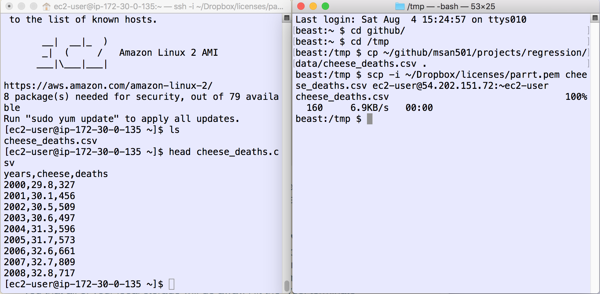
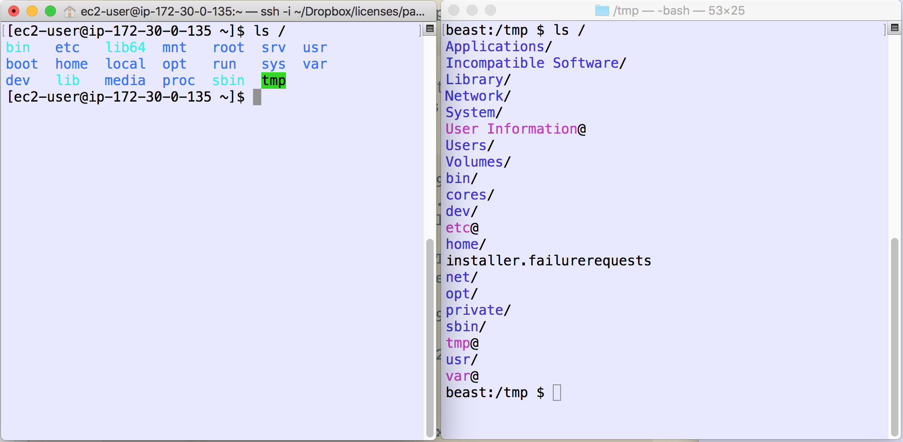

# Launching a Virtual Machine at Amazon Web Services

The goal of this lecture-lab is to teach you to create a Linux machine at *Amazon Web Services*, login and copy some data to that machine.


Here is a video I made for MSAN692 showing [how to launch an AWS instance and start a Python-based web server](https://www.youtube.com/watch?v=qQncEJL6NHs&t=2s).

##  Discussion

Login to AWS and go to your [AWS console](http://aws.amazon.com/console) and click on the "EC2" link.


Click "Launch Instance", which will start the process to create a virtual machine in the cloud. An instance is just a virtual machine.


Select the "Amazon Linux 2 AMI" entry, which should be the first one.  This is a commonly-used "image" that results in a Linux machine that contains lots of useful goodies as you can see from that list, such as Python and MySQL. An image is just a snapshot of the disk after someone carefully installs software properly on a Linux machine. This means we don't have to install software every time we create a new machine.


Select instance type "t2.micro," which should be the first machine type listed. This machine is very low powered but is sufficient for playing around. Click "Review and launch"


This will bring up a screen describing the details about the instance we are launching. Ignore all of it for now and just click "Review and Launch" at the bottom right. That brings up a summary page that we could examine if we wanted, but just click "Launch" in bottom right.

This will bring a dialog box up to select a key pair. A key pair is what allows you to securely access the server and prevent unauthorized access. The *first time*, you will need to create a new key pair. Name it as your user ID then click on "Download key pair."  It will download a *userid*.pem file, which are your security credentials for getting into the machine. Save that file in a safe spot. If you lose it you will not be able to get into the machine that you create. From now on, you can reuse that pre-existing key.


After downloading, click "Launch instances." You should see something like:


Click on the `i-...` link to go to the EC2 console showing your instance.


Click on your instance and you should see a description box at the bottom. Look for the "Public IP" address, which is 54.196.174.210 in this case:


We have to wait until the status stops saying "Initializing", which could take several minutes.

## Connecting to the remote server

Click on the "Connect" button at the top of the page and it will bring up a dialog box that tells you how to connect to the server.  You want to connect with "A standalone SSH client" link (Java is now a security risk in the browser so we can't use that choice.)  Inside you will see the `ssh` command necessary to connect to your machine. If you have Windows, there is a link to show you how to use an SSH client called PuTTY. 


 Before we can connect, we have to make sure that the security file is not visible to everyone on the computer (other users). Otherwise ssh will not let us connect because the security file is not secure:

```bash@@@@@@@@@@@@@@@@@@@@@@@@@@@@@@@@@@@@@@@@@@@@@@@@@@@@@@@@@@@
@         WARNING: UNPROTECTED PRIVATE KEY FILE!          @
@@@@@@@@@@@@@@@@@@@@@@@@@@@@@@@@@@@@@@@@@@@@@@@@@@@@@@@@@@@
Permissions 0644 for '/Users/parrt/Dropbox/licenses/parrt.pem' are too open.
It is required that your private key files are NOT accessible by others.
This private key will be ignored.
bad permissions: ignore key: /Users/parrt/Dropbox/licenses/parrt.pem
Permission denied (publickey).
```

Whoa!  Do this:

```bash
$ cd ~/Dropbox/licenses
$ ls -l parrt.pem
-rw-r--r--@ 1 parrt  parrt  1696 Aug  4 15:15 /Users/parrt/Dropbox/licences/parrt.pem
```

To fix the permissions, we can use whatever "show information about file" GUI your operating system has or, from the command line, do this:

```bash
$ cd ~/Dropbox/licenses
$ chmod 400 parrt.pem
```

which changes the permissions like this:

```bash
$ ls -l parrt.pem
-r--------@ 1 parrt  501  1696 Aug  1 12:12 /Users/parrt/Dropbox/licenses/parrt.pem
```

Don't worry if you don't understand exactly what's going on there. It's basically saying that the file is only read-write for me, the current user, with no permissions to anybody else.

For mac and linux users, we will use the direct `ssh` command from the command line. It will be something like:

```bash
ssh -i parrt.pem ec2-user@54.196.174.210
```

Naturally, you will have to provide the full pathname to your *userid*.pem file. So I need to type:

```bash
ssh -i ~/Dropbox/licenses/parrt.pem ec2-user@54.196.174.210
```

Try to connect again and it will now warn you that you have never connected to that machine before. Again, this is a security measure. You can simply say "yes" here.

```bash
$ ssh -i parrt.pem ec2-user@54.196.174.210
The authenticity of host '54.196.174.210 (54.196.174.210)' can't be established.
ECDSA key fingerprint is SHA256:BYGiV2qRthhw52HQni5vnoRtiT16cplmdbXAuXqQdqc.
Are you sure you want to continue connecting (yes/no)? yes
Warning: Permanently added '54.196.174.210' (ECDSA) to the list of known hosts.
Last login: Thu Aug  4 20:04:07 2016 from sentinel.cs.usfca.edu

       __|  __|_  )
       _|  (     /   Amazon Linux AMI
      ___|\___|___|

https://aws.amazon.com/amazon-linux-ami/2016.03-release-notes/
8 package(s) needed for security, out of 17 available
Run "sudo yum update" to apply all updates.
[ec2-user@ip-172-30-0-97 ~]$ 
```

The `$` is your prompt just like you have on your local machine using the terminal / shell, but you are giving commands to a remote server not your local machine.


## Multiple shells

You can either hit "command-T" from Terminal.app and get multiple tabs up, one for the remote host and one for local/laptop work:


Or just get two windows up using "command-N" from Terminal.app.



Verify the remote computer is not your laptop by doing command `ls /` on both computers:


 
## Uploading data or code

To get data up to the server, you can cut-and-paste if the file is small. For example,  cut-and-paste the following data into a file called `coffee` in your home directory on that remote computer. First copy this data from these notes:

```bash
3 parrt
2 jcoker
8 tombu
```

then launch the `nano` editor on the remote computer:

```bash
[ec2-user@ip-172-30-0-97 ~]$ nano coffee
```

Paste the data into that file and type control-X and then "Yes" to save the file. You should pop back to the prompt after exiting.

```bash
[ec2-user@ip-172-30-0-97 ~]$ cat coffee # print it back out
3 parrt
2 jcoker
8 tombu
$ 
```

For larger files, we need to use the secure copy `scp` command that has the same argument structure as secure shell `ssh`. Get another shell running on your laptop. Download data file [cheese_deaths.csv](https://raw.githubusercontent.com/parrt/msan501/master/projects/regression/data/cheese_deaths.csv) and store on your laptop in the directory where you are currently working on the laptop command line. Now, in a shell **on your laptop**, use the following command (that is similar to `ssh`) to copy it to the remote computer:

```bash
$ scp -i ~/Dropbox/licenses/parrt.pem cheese_deaths.csv ec2-user@54.196.174.210:~ec2-user
cheese_deaths.csv                                100%  160     6.9KB/s   00:00
$ 
```

Do not forget the `~ec2-user` on the end of that line.  The general form of the command is:

scp -i *your-pem-file* *file-to-copy* *user*@*machine-name*:*directory-on-remote-machine*

From the shell that is connected to the remote server, ask for the directory listing and you will see the new file:

```bash
[ec2-user@ip-172-30-0-135 ~]$ ls
cheese_deaths.csv
[ec2-user@ip-172-30-0-135 ~]$ head cheese_deaths.csv 
years,cheese,deaths
2000,29.8,327
2001,30.1,456
2002,30.5,509
2003,30.6,497
2004,31.3,596
2005,31.7,573
2006,32.6,661
2007,32.7,809
2008,32.8,717
```

To exit the remote server, type `exit` or use `^D` from the `$` prompt. The machine will still be running but you're no longer connected to it from your laptop.

Play around with your instance and then **TERMINATE YOUR INSTANCE WHEN YOU ARE DONE**, otherwise you will continue to get charged for the use of that machine. Right-click on the instance from your AWS console and select "instance state" then submenu "terminate". It will warn you that all of your local storage will go away. Hit the "yes, terminate" button. It should look like this when done:


If you say "stop" instead, it will stop the machine, but you still get charged, but just a little for the storage associated with that machine. On the other hand, this is useful because you can restart that machine without having to go through this whole procedure. All of your data will be intact. If you say "Terminate", it will toss the machine out and you will have to go through this procedure again to get a new machine.
