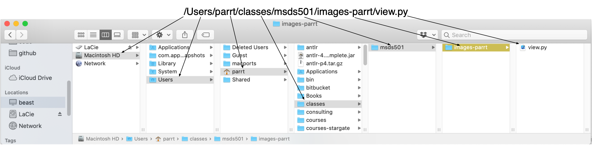

# Bash your way to victory

## Goals

* Launch a UNIX "shell" ("command line" or "terminal")
* Set the working directory
* List the files in that directory
* Launch Python from the shell
* Print command-line arguments to a Python program

Here is a fun [terminal game from MIT](http://web.mit.edu/mprat/Public/web/Terminus/Web/main.html).

## Description

*OS X just changed the default shell to be `zsh` not `bash`*

The UNIX shell is an interactive domain specific language used to control and monitor the UNIX operating system, which includes processes, devices, ram, cpus, disks etc. It is also a programming language, though we’ll use it mostly to move files around, execute commands, etc. (If you have to use a Windows machine, either install Windows Subsystem for Linux (WS) or launch a UNIX box and Amazon Web services.)

You need to get comfortable on the UNIX command line because we will control all of our cloud computing facilities using the command line.

When you first start up the `Terminal.app` or launch a shell using whatever Linux app you have, you will see either a simple dollar prompt or something more complicated that displays the current directory or current machine etc:

```bash
$ 
```

The shell is just an interactive interpreter like we have with Python:

```python
>>> print("hello")
hello
>>>
```

To do the same thing in bash:

```bash
$ echo "hello"
hello
$
```

The shell has a number of state variables, one of which is the *current working directory*, and it is by far the most important. Most commands that we execute will be relative to this working directory.  Imagine looking at a Finder window. The "current working directory" is the currently highlighted directory (folder) in that window. It just indicates what your focus is.

You can print out the current working directory with command to figure out "where" the shell thinks you are:

```bash
$ pwd    # pwd means print working directory
/Users/parrt/github/msds501/notes
$ 
```

After you execute a command by typing a command possibly with arguments and hitting return, you get the prompt back. It is ready for another command.

## Your path to success

Each file on your disk has a unique identifier. You might have 50 files with the same name, but if they are in different directories, they must be different files.  The way in which we specify a unique identifier is to concatenate all of the directory names starting at the root (highest folder on your disk) using a `/` character as a separator between directory and file names.

There are two kinds of paths: *absolute* and *relative*.

1. Any *path* starting with `/` means it is an absolute path starting at the root of the disk directory hierarchy. (You can learn more about [paths at wikipedia](https://en.wikipedia.org/wiki/Path_(computing)#Unix_style)).
2. So anything else is considered relative to the current working directory. For example, if your current working directory is `/Users/parrt/github/msds501` then `ls notes` will give you a directory listing of the `notes` directory underneath `/Users/parrt/github/msds501`. 

Here's a useful diagram showing the components of a fully qualified pathname to a file called `view.py`:



If the current working directory is `/Users/parrt/classes`, then the relative path to that file is `msds501/images-parrt/view.py`.

Note that `~` is a special character that means "user's home directory".  On a Mac that is `/Users/YOURID` for whatever YOURID is. For me that is `/Users/parrt`. And, no, your user id is not `YOURID`. 

One of the most common things to do is to change the current working directory with `cd`:

```bash
$ cd /Users/parrt/github/msds501
$ pwd
/Users/parrt/github/msds501
$ 
```

You can ask for a list of the files (`ls`) in that directory:

```bash
$ ls
LICENSE      README.md    data/        labs/        notes/       projects/
```

## Executing programs from the shell

There are lots of programs on the disk. You can launch them simply by using their name as the first element on a command line. For example, here's how we start a Python shell:

```bash
$ python
Python 3.8.3 (default, Jul  2 2020, 11:26:31) 
[Clang 10.0.0 ] :: Anaconda, Inc. on darwin
Type "help", "copyright", "credits" or "license" for more information.
>>> 
```

That of course gives us a new prompt, `>>>`, which is for Python. We can exit Python by hitting control-D (which means "end of file"). As we exit Python it will take us back to the shell and the `$` prompt.

Program options are like function arguments and typically start with `-` or `--`. For example, here's how to get more information from `ls`:

```bash
$ ls -l
total 32
-rw-r--r--+  1 parrt  staff  1069 Aug 10  2018 LICENSE
-rw-r--r--+  1 parrt  staff  9083 Aug 10  2018 README.md
drwxr-xr-x+ 23 parrt  staff   736 Aug 10  2018 data/
drwxr-xr-x+  6 parrt  staff   192 Aug 10  2018 labs/
drwxr-xr-x+ 35 parrt  staff  1120 Oct  8 12:45 notes/
drwxr-xr-x+ 10 parrt  staff   320 Feb 22  2019 projects/
```

Anything that follows the name of the command is considered an argument to that command. Here is how to get the directory listing for a specific directory even if we're not currently in that directory:

```bash
$ ls /usr
X11@        bin/        libexec/    sbin/       standalone/
X11R6@      lib/        local/      share/
```

The notation is generally:

*command arg1 arg2 arg3*

That is analogous to the following function call in Python:

*command(arg1, arg2, arg3)*
 
As another example, here is how we execute a specific Python script rather than entering interactive Python mode:

```bash
$ python myscript.py
... any output from the script ...
```

Naturally, we often want to pass arguments to the Python script itself. These arguments simply follow the script name given to the `python` command. For example, here is a simple script that, which prints any arguments to the script (let's put it into `args.py`):

```python
import sys
print("args:", sys.argv)
```

We run that script like this:
 
```bash
$ python args.py
args: ['args.py']
$ python args.py hello
args: ['args.py', 'hello']
$ python args.py hi mom
args: ['args.py', 'hi', 'mom']
```

Notice that spaces separate the arguments and so `hi mom` appears to be two different arguments. This is a very good reason why you should never use spaces in your directory or file names---it's hard to specify such names on the commandline because the space is misinterpreted.