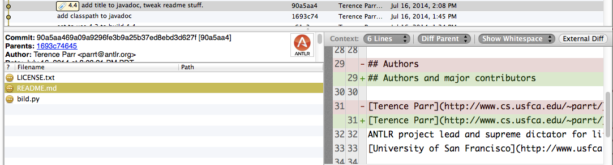

# Using git revision control

Every single commercial developer I know uses revision control at work. Every company you will encounter uses it. For that reason alone, you need to learn revision control to be functional in a commercial setting.  In this class, you also use revision control system called `git` to submit your work.

For our purposes in MSAN, we're going to ignore most of the nontrivial capabilities that programmers use routinely, such as branching and merging. Git is extremely  complicated and would not be my first choice if it weren't for the excellent `github.com`.

## Introduction to revision control

*Revision control* is a mechanism to track all changes to a set of files, which we typically associate with a single project. The file set is called a *repository* and at any given time, my computer has lots and lots of these repositories. 

A `git` repository instance is just a directory on your disk that also happens to have a `.git` (hidden) directory, which is effectively a complete database of everything that's happened to the repository since it was created with `git init` (or you `clone`'d it from somewhere). 

A repository is more than just a set of files. When asked to do so with a "commit" command, the repository takes a complete snapshot of the state of the repository files. This is very similar to OS X's Time Machine backup system that wakes up every hour and takes a snapshot. The difference between the repository and a backup system is that we instruct the repository when to take a snapshot. Each snapshot should be a logical chunk of work done to the files.

Having a complete list of changes is extremely useful. For example, here is a chunk taken out of the middle of my commits on the ANTLR repository as shown by SourceTree:


You can go back and look at changes made to the repository for any commit.

 You will also notice that I have tagged a particular commit as ``4.4`` with the ``tag`` command. This makes it easy for me to flip the repository back to a specific commit with a name rather than one of those funky commit checksums. Here is what that particular commit consisted of per [SourceTree](https://www.sourcetreeapp.com):



If you want to throw out the repository, just remove the entire subtree from your disk. There is no central server to notify. Every repository instance is a complete copy so you could have, for example, 10 versions of the repository cloned from an original sitting on the same disk in different directories.

### Files managed by git

After you create a repository, you can create all sorts of files under the directory managed by git, but git ignores them until you `add` them. The `add` command is basically notifying the repository that it should care about that file. When you add files or modify files already known to git, they are in the so-called **staging area** (this used to be called the index). You can have whatever other files you want laying around, such as PyCharm preference files. Git will simply ignore them unless you `add` them. 

### Committing changes

Once git knows the set of files it should manage, it watches all the changes we make to those files. If we go down a wrong path and would like to revert all those changes, git can easily do that. It can revert any changes since the last commit and can even reset the repository to the state of some earlier commit.

### Does a solo programmer need revision control?

If you are working solo, from a single machine, and you have a regular backup mechanism in your development environment or from the operating system like Time Machine (OS X), you can get away without a formal revision system.

There are lots of important operations that can be faked without a revision system.  For example, it's a good idea to keep track of versions of the software that work or other milestones. In the old days, people would make a copy of their project directory corresponding to important milestones like "Added feature X and it seems to work." You can do comparisons using a diff tool in between directories.

Whether your IDE does it or a revision control system does it, I find it very important to look back at recent changes to see what changes have introduced a bug.  Sometimes I decide to abandon a small piece of what's going on and flip a file back to an old version.

A good example of use of a repository is the repository for this course, which is stored at `github.com` as well as my desktop computer (and laptop, and home machine, ...):

\href{https://github.com/parrt/msan501}{\textcolor{blue}{https://github.com/parrt/msan501}}

It contains all the changes that I've made since I started teaching this course.

These days, revision control systems are meant to be used among multiple computers and multiple developers, but they are still useful even on a single machine.

### Solo programmer, sharing across machines

In order to work on that software from your home machine and a laptop for example, you have to make copies. That introduces the possibility that you will overwrite the good version of your software. Or, you will forget that you had made changes on your laptop but have now made a bunch of changes on your desktop.  You have changes on two different computers. Resolving things can be tricky and error-prone.

Enter a remote server such as `github.com`. It acts like a big disk that holds lots of different repositories per user. I normally create a repository at the website, then grab the repository URL, and `clone` it onto my local disk of any machine that needs to share the code. The process of sharing changes looks like this:


* Laptop: pull any changes from the github repository
* Laptop: Make changes
* Laptop: Push changes to github server
* Desktop: pull changes from the github repository (stuff you just changed)
* Desktop: Make changes
* Desktop: Push changes to github server

The github repository acts as a central repository, which is a change of perspective. Normally we think of our computer is having the primary copy.

As a side benefit, pushing your repository to a remote server gives you a backup automatically.

### Multiple programmers

When you add another person to a project, people end up mailing code around but it's difficult to perform a merge. My experience watching students do this reveals that two versions of the software always appear. Both students shout that their version is better and that the other version should be abandoned.

In my experience, no matter how you try to fake multiple states of the source code and share, merging changes to work on the same code base is a nightmare.

Once in a while I go back and I look at the history of changes. Sometimes I want to know who screwed this up or I want to see the sequence of changes that I made or that were made by somebody else.

Every single commercial developer I know uses revision control at work. Every company you will encounter uses it. For that reason alone, you need to learn revision control to be functional in a commercial setting.

## Common repository operations

**Cloning a repo**. To make a copy of a repository that exists on github, we need a URL for that repo. For illustrative purposes, let's say we want to clone the [antlr4 repo](https://github.com/antlr/antlr4). If we choose the SSH version, it will require that we set up SSH keys for authentication:


So, instead, click on the "Use HTTPS" link, which will give you a URL like `https://github.com/antlr/antlr4.git`.

Once you have that URL in your paste buffer, go to the command line and `cd` into the directory where you want to perform the clone then give a clone operation:

```bash
$ cd ~/projects
$ git clone https://github.com/antlr/antlr4
...
```

This will make a copy of all of the files in the `antlr4` repository in subdirectory `antlr4` of `~/projects`. Furthermore, it will also bring in a copy of the transaction database, which is a record of every change made to that repository (ever).

**Adding to repo**. To make git pay attention to files, we add them. Just create a file:

```bash
$ cd ~/myrepo
$ mkdir junk
$ cd junk
... create t.py ...
$ git add t.py
```

The file is not really part of the repository until we commit the transaction. Until the commit, it is in a staging area. It's kind of like putting everything in a box (add) and then mailing the box (committing). Here's how to do the commit:

```bash
$ git commit -a -m 'adding a cool file'
...
```

The `-m` is the option that indicates a commit message follows on the command line.  You can safely ignore what `-a` means, but make sure you always have it on your commit commands.

You can also create files in subdirectories:

```bash
$ cd ~/myrepo
$ mkdir junk
$ cd junk
... create t2.py ...
$ git add t2.py
$ git commit -a -m 'add 2nd file'
```

**Make changes**. You can make changes and do another commit. Make sure use the `-a` option on the `git commit`.

```bash
...change existing file(s)...
$ git commit -a -m 'what I due to file(s)'
```

**Deleting files**. Deleting a file is also considered a change but you can also use `git rm` *filename*.

```bash
$ git rm t2.py
$ git commit -a -m 'I do not need t2 anymore'
```

**Checking differences with repo**. If you make a change and want to know how it's different from the current repository version, just use diff:

```bash
$ ... tweak t.py ...
$ git diff t.py
...
```

**Reverting**. If you screw up and want to toss out **everything** from the last commit, do a hard reset (make sure you use the `--hard` option):

```bash
$ ... tweak whatever you want ...
$ git reset --hard HEAD
```

This throws out all changes since the last commit. If all you want to do is revert uncommitted changes to a single file, you can run this:

```bash
$ git checkout -- filename
```

I think they call that funny dash-dash option ``sparse mode.'' (Git is the machine code of revision systems. blech.)

**Correcting commit message**. One of the other things I often have to do is to fix the commit message that I just wrote in a commit command.

```bash
$ git commit --amend -m "I really wanted to say this instead"
```

**Checking working dir and staging area vs repo.** Finally, if you want to figure out what changes you have made such as adding, deleting, or editing files, you can run a `status`:

```bash
$ git status
On branch master
Your branch is up-to-date with 'origin/master'.

Untracked files:
  (use "git add <file>..." to include in what will be committed)

    t3.py

nothing added to commit but untracked files present (use "git add" to track)
```

This report is basically saying you have not changed any files tracked by the repository and that there is a file laying around called t3.py that is not tracked.

## With a remote server like github

When you're working by yourself (and without branches), a remote server acts like a central server that you can push and pull from. For example, I push from my work machine and pull to my home machine or my laptop. And then reverse the process with changes I make at home over the weekend.

For example, once I have committed all of my changes that work and I'm ready to go home, I push to the origin:

```bash
$ git push origin master
```

From home, I do:

```bash
$ git pull origin master
```

The origin is the alias for the original server we cloned from and master is our master branch, which we can ignore until we look at branches.

To look at the remote system alias(es), we use:

```bash
$ git remote -v
origin  git@github.com:parrt/myrepo.git (fetch)
origin  git@github.com:parrt/myrepo.git (push)
```

