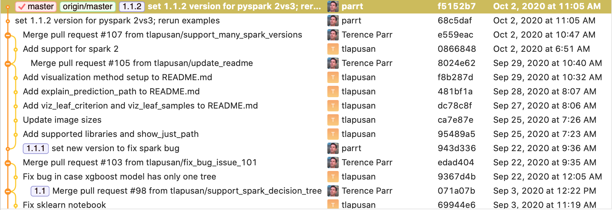
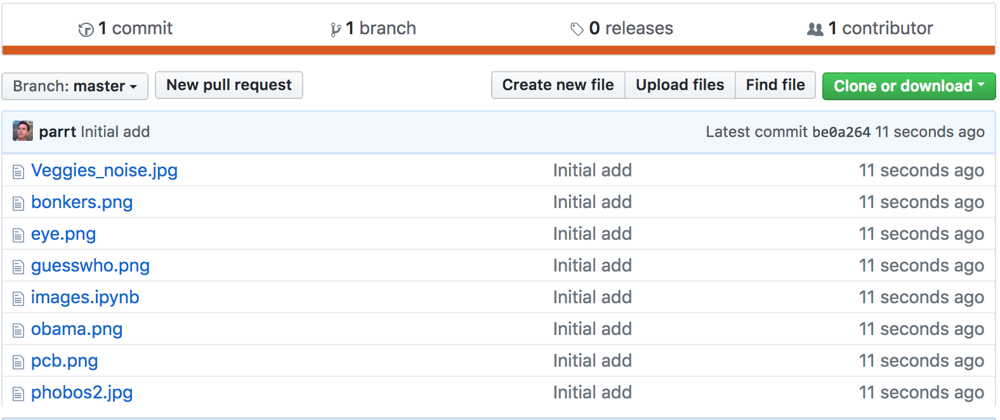

# Using git revision control

**Motivation**. Every single commercial developer uses revision control at work. Every company you will encounter uses it. For that reason alone, you need to learn revision control to be functional in a commercial setting.  In this class, you will also use revision control, a system called `git`, to submit your work.

For our purposes in MSAN, we're going to ignore most of the nontrivial capabilities that programmers use routinely, such as branching and merging. Git is extremely complicated and would not be my first choice if it weren't for the excellent `github.com`.

In this lecture-lab, the goal is to get a basic understanding of how revision control and git/github work. We will take the opportunity to learning the primary git commands by getting you started on the images project repository.

Here is an interactive [git "game"](https://github.com/git-game/git-game) to help you learn. There are lots of [course materials](https://lab.github.com/courses) on the web.

## Introduction to revision control

Let me start out with a small detour to drive home that you should be making backups of your laptop. Imagine losing your laptop. Where will all your work be? Gone. I recommend Carbonite or Mozy. Personally, I have a local Timemachine OS X backup hard drive sitting next to my computer that takes a snapshot every hour. It tracks the differences from the previous snapshot, rather than copying the entire hard drive again (slow/wasteful). Then, I have an off-site cloud-based backup with Carbonite that gets backed up when I go to sleep at night.  

Using this multi-tiered backup strategy is a good way to think about how programmers use revision control. git is kind of like Time Machine, a local backup, and github.com is kind of like the off-site Carbonite cloud-based backup. The difference between a revision control system and a backup system is that we instruct the revision control system **when** to take a snapshot. Each snapshot should be a logical chunk of work done to the files. A backup system automatically takes snapshots.

Not only do we tell a revision control system when to take a snapshot, we also tell it **what** to snapshot.  Each project you work on is in a directory and all of the files associated with that project sit somewhere in that subtree. The file set is called a *repository* and at any given time, my computer has lots and lots of these repositories. 

A `git` repository instance is just a directory on your disk but it also has a `.git` (hidden) directory. This directory holds a complete database of everything that's happened to the repository since it was created with `git init` (or since you `clone`'d it from github). If you want to throw out the repository, just remove the entire subtree from your disk. There is no central server to notify. Every repository instance is a complete copy so you could have, for example, 10 versions of the repository cloned from an original sitting on the same disk in different directories.

**Tracking changes**

As with the Time Machine backup, git tracks snapshots as the difference from the last time you requested a snapshot.  Each snapshot is called a *commit* (and programmers think of these commits as *transactions*.) You should request a commit to lock in a logical chunk of work, such as the addition of a feature or fixing of a bug. Having a complete list of changes is extremely useful. For example, here is a chunk taken out of the middle of my commits on the ANTLR repository as shown by the [SourceTree](https://www.sourcetreeapp.com) git GUI:



You can go back and look at changes made to the repository for any commit. Whether using PyCharm or git, I find it very important to look back at recent commits to see what changes have introduced a bug.  Sometimes I decide to abandon a small piece of what's going on and flip a file back to an old version. If you go down a wrong path and would like to revert all those changes, git can easily do that. It can even reset the repository to the state of some earlier commit.

**Mirroring repositories at github.com**

Continuing with the analogy now, github.com is like the off-site cloud-based backup I use. We will typically keep a complete copy of our local repositories at github.com. As with committing changes, we also have to specifically *push* the local repository to github. Every push ensures that the complete file set and git change database (in .git subdirectory) is mirrored at github.  As a side effect of this, of course, you now have a backup of your work. The loss of your laptop is not catastrophic, at least as far as your coursework is concerned.

The reason to use github is that I can also access your repositories then, whereas I have no access to your laptop hard drive. To grade your projects, I will *clone* your repository onto my hard disk. If you make changes, I can *pull* those in. I might also edit your code to make comments and then *push* my copy of the repository back to github and then you can *pull* those changes back to your hard drive. Everything will be in sync and it will not overwrite changes by mistake. This is how multiple programmers communicate and is a bit beyond this introductory lecture, but you should be aware of this in the abstract at least.

It's also the case that you can use github.com to work on the same software on two different computers, such as a laptop and a desktop.  Having two computers with the same software means they have copies. That introduces the possibility that you will overwrite the correct/latest version of your software. Or, you will forget that you had made changes on your laptop but have now made a bunch of changes on your desktop.  You have changes on two different computers. Resolving things can be tricky and error-prone so we use push/pull to github to keep things in sync.

## Getting started on the images project

You will receive a link to github that is an invitation to create a repository for the images project. After you accept, it will give you a link to the private repository (only you and I can see the contents of the repository). My github id is `parrt` and so my URL is:

```
https://github.com/USF-MSAN501/images-parrt
```

Each class I teach will have be its own organization at github, in this case: `https://github.com/USF-MSAN501`. Each person will have a repository under that directory at github, one per project.

Our first step is to *clone* that empty repository from github onto our local disk. From your repository page and github, copy the HTTPS URL, as shown here:


If you choose the SSH version, it will require that we set up SSH keys for authentication. That is what you will ultimately want to do, but for now, don't worry about that and just use HTTPS.

**Cloning onto your laptop**

Now, open the terminal or other bash shell program and create a directory that will house all of your MSAN projects in an orderly fashion. I strongly recommend you create an overall directory under which you create a directory for each class. From the command line it looks like this:

```bash
$ pwd             # print working directory
/Users/parrt     
$ mkdir classes   # make directory called classes
$ cd classes      # change current working directory to classes
$ mkdir msan501   # create directory msan501 under classes
$ cd msan501      # jump into msan501
```

Do not use spaces in any filename or directory you ever create. Many open source projects are developed under UNIX and UNIX hates spaces in filenames. Things will mysteriously fail to work if you use spaces.

Depending on how you have your shell set up, you might see the current working directory to the left of the `$` prompt. Here is what my prompt looks like:

```bash
beast:~/classes/msan501 $ 
```

The name of my machine is beast and `~` is shorthand for `/Users/parrt` or whatever your user ID is.
 
Now we have an appropriate structure and it's time to clone your repository under `/Users/parrt/classes/msan501`:

```bash
$ git clone https://github.com/USF-MSAN501/images-parrt.git
Cloning into 'images-parrt'...
warning: You appear to have cloned an empty repository.
$ cd images-parrt/
$ ls
```

After cloning, you have an empty directory under `msan501` called `images-YOURID`. It is under this directory that you will do all of your work. **This directory is called the repository**. Technically it's not empty, if you ask for all files in the current directory with `-a` option on `ls` command, you will see the subdirectory used by git to store snapshots:

```bash
$ ls -a
./                 ../                .git/
```

**Files managed by git**

After you create a repository at github and clone it locally, you can create all sorts of files under the directory managed by git, but git ignores them until you `add` them. The `add` command is basically notifying the repository that it should care about that file.  You can have whatever other files you want laying around. Git will simply ignore them unless you `add` them.

Download [images-starterkit.ipynb](https://github.com/parrt/msan501/blob/master/projects/images-starterkit.ipynb) from github to your images-YOURID directory and call it `images.ipynb`. The cool kids do download and rename without the browser in one command:

```bash
$ curl -o images.ipynb https://github.com/parrt/msan501/raw/master/projects/images-starterkit.ipynb
  % Total    % Received % Xferd  Average Speed   Time    Time     Time  Current
                                 Dload  Upload   Total   Spent    Left  Speed
100 41311    0 41311    0     0  87895      0 --:--:-- --:--:-- --:--:-- 87895
$ ls
images.ipynb
```

If `curl` isn't installed, use `brew` to install it.


**Taking a snapshot (committing)**

We have a file in the directory but git has no idea it should track it. We have to explicitly add it to revision control:

```bash
$ git add images.ipynb
$ git status
On branch master

Initial commit

Changes to be committed:
  (use "git rm --cached <file>..." to unstage)

	new file:   images.ipynb
...
```

At this point, we would be free to add more files or change that file. When we want to make a snapshot, we commit our changes:

```bash
$ git commit -a -m 'initial add'
[master (root-commit) b40aca4] initial add
 1 file changed, 9 insertions(+)
 create mode 100644 images.ipynb
```

The `-m` is the option that indicates a commit message follows on the command line.  You can safely ignore what `-a` means, but make sure you always have it on your commit commands.

Until the commit, the file changes are in a so-called staging area. It's kind of like putting everything in a box (add) and then mailing the box (committing).

**Pushing back to github**

Every time you do a commit, you're making a snapshot of the current state of your files. Git tracks the set of changes per commit and a commit message, which we can retrieve easily:

```bash
$ git log
commit b40aca41ed4b94731a2ec87e9c11a60a1a4ef234
Author: parrt <parrt@cs.usfca.edu>
Date:   Fri Jun 30 12:50:42 2017 -0700

    initial add
```

Until you explicitly push back to github, github has no idea that you made changes on your local disk to a repository. Git knows where the original repository came from but it does not automatically push anything to github upon commit. Commit is for the local repository, push is for syncing with a remote repository.  The remote repository is called the *origin*. Use the following command to ask git what it thinks the origin is:

```
$ git remote -v
origin	https://github.com/USF-MSAN501/images-parrt.git (fetch)
origin	https://github.com/USF-MSAN501/images-parrt.git (push)
```

Ok, let's push our changes (we added a file) back to github:

```bash
$ git push origin master
Counting objects: 3, done.
Delta compression using up to 8 threads.
Compressing objects: 100% (2/2), done.
Writing objects: 100% (3/3), 408 bytes | 0 bytes/s, done.
Total 3 (delta 0), reused 0 (delta 0)
To github.com:USF-MSAN501/images-parrt.git
 * [new branch]      master -> master
```

There is a lot going on in that message, but if there are no errors, you're good to go. The *master* is what we call a branch and you will always be working in the master branch.

Until you get very comfortable with git and github, you should always verify that your pushes succeed by examining the remote repository at github. Refresh your version of the `https://github.com/USF-MSAN501/images-parrt` URL and it should show file `images.ipynb` (and any others you've pushed). Once you've downloaded, unzipped, `add`ed the [image project images zip](https://github.com/parrt/msan501/blob/master/projects/images-expected-output.zip?raw=true), and pushed back to github, your github page should look like:



Make sure that all of the files that you want to submit for your projects get properly committed locally and then pushed back to github!
 
**Making changes**

You can make changes and lock them in with another commit. (Make sure use the `-a` option on the `git commit`.)

```bash
...change existing file images.ipynb from jupyter lab...
$ git commit -a -m 'what I did to images notebook'
```

**Deleting files**

Deleting a file tracked by git is also considered a change but you can also explicitly use `git rm` *filename*, which is what I do.

```bash
$ git rm foo.py
$ git commit -a -m 'I do not need foo anymore'
```

**Checking differences with repo**

If you make a change and want to know how it's different from the current repository version, just use diff:

```bash
$ ... tweak images.ipynb ...
$ git diff images.ipynb # kinda sucks with notebooks
...
```

**Reverting**

If you screw up and want to toss out **everything** since the last commit, do a hard reset (make sure you use the `--hard` option):

```bash
$ ... tweak whatever you want ...
$ git reset --hard HEAD
```

This throws out all changes since the last commit. If all you want to do is revert uncommitted changes to a single file, you can run this:

```bash
$ git checkout -- filename
```

I think they call that funny dash-dash option "sparse mode." (whatever. yuck.)

