# Exploration of Enron email data set

The goal of this project is to learn how to collect, filter, aggregate, explore, and visualize data from a large collection of files. You will also learn how to use the really nice [networkx](https://networkx.org) network analysis library. Our data set is a well-known collection of emails, sent and received within an energy company called Enron, that was collected by the FBI as part of a massive fraud investigation. According to an [FBI retrospective](https://www.fbi.gov/history/famous-cases/enron), "*The Enron Task Force’s efforts resulted in the convictions of nearly all of Enron’s executive management team*" and goes on to say:

> Top officials at the Houston-based company cheated investors and enriched themselves through complex accounting gimmicks like overvaluing assets to boost cash flow and earnings statements, which made the company even more appealing to investors. When the company declared bankruptcy in December 2001, investors lost millions

This is purely an exercise, but it's interesting to see how with a small bit of effort we can identify some unusual email behavior that could indicate inappropriate activity. For example, [Fortune magazine](https://archive.fortune.com/magazines/fortune/fortune_archive/2005/03/07/8253428/index.htm) reports that "*the former head of Enron's trading operations, John Lavorato, [...] sold all his Enron stock in spring 2001 at about \$63 per share. (It was worth pennies by December.)*" Now, take a look at the histogram depicting the email activity sent by Lavorato.  About the time he knew they were going to be busted, he all of a sudden stops communicating over email, at least his work email, which is weird for a top executive. He must have started using a private channel to hide communications with co-conspirators.

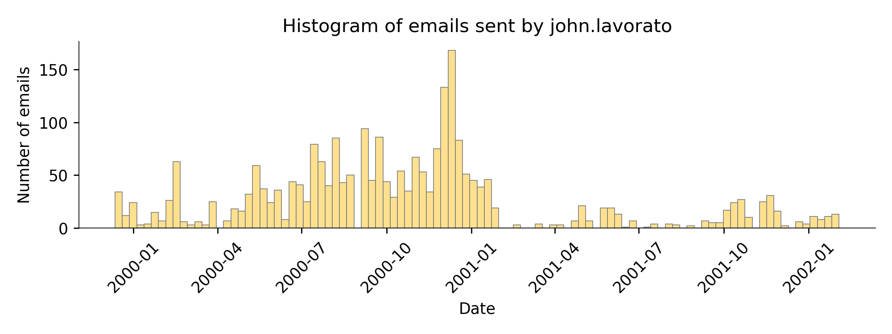

You have two primary tasks:

1. Load 1.5G worth of email messages and construct a tidy data frame that is much easier to process than the raw data (takes about 3 minutes); you will save this in [feather format](https://pypi.org/project/pyarrow) so that it can be loaded extremely quickly; here's a sample:<br>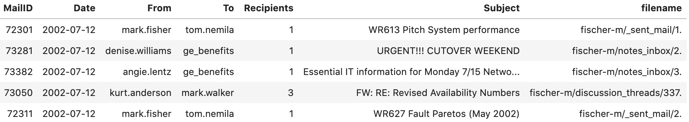
2. Create a jupyter notebook that loads the data frame created in the previous step and then generates tables and visualizations as part of an exploration. (Details below.)

Your projects will be graded via a series of unit tests operating on the data frame you create and my evaluation will examine a PDF that you generate and submit from your notebook.

Unlike your previous projects, you will be programming from a blank screen, without a template. As part of your education, you have to learn to start from scratch. Rather than requiring a specific set of methods, unit tests will examine the data frame you save in feather format.  To make it easier for me to grade your notebooks, however, I am providing a standard set of sections you should fill in with code and visualizations.

## Process 1.5G of Enron email

Your first goal is to create a condensed version of the enron email messages in the form of a data frame and then save that in feather format. The email is stored in a series of subdirectories organized by person and by mail folders, where the individual messages are numbered as you can see here:

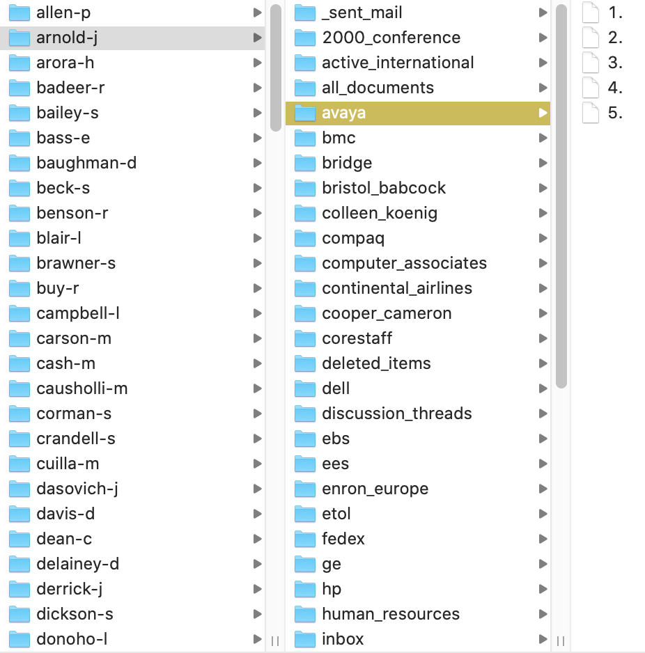

Begin by downloading the very large (1.7G) [Enron data set](https://www.cs.cmu.edu/~./enron/enron_mail_20150507.tar.gz) and untar/unzip it. You will find a `maildir`, which contains the email messages organized by user. **Please do not try to add/commit your mail directory or the `.tar.gz` file to your repository!**

Create a Python script in the root of your repository called `condense.py` that accepts the mail directory as a commandline argument so that you will run your program like this:

`python condense.py` *path-to-maildir*

where *path-to-maildir* indicates the exact path of your mail directory. This allows us to place the mail directory anywhere on the disk and still use the same script. The execution of your finished script takes about two or three minutes depending on the speed of your machine. After execution, your script should leave file `enron.feather` in the current working directory (the directory from which you execute the `python` command). The columns of the data frame must be exactly these columns and in this order: `MailID`, `Date`, `From`, `To`, `Recipients`, `Subject`, `filename`; for example:


`Recipients` indicates the number of people on the `To:` line for a single email message file and `filename` is the subdirectory of `maildir` plus the filename that contains the mail message.

(You will need to install Python `pyarrow` package to save in feather format.)

### Getting started by sniffing the data

At the beginning of a project, we know very little about how to proceed or what to do, so we have to explore. A great way to start is by looking at the data we have. Here's a simple email message with all of the email headers as a prefix:

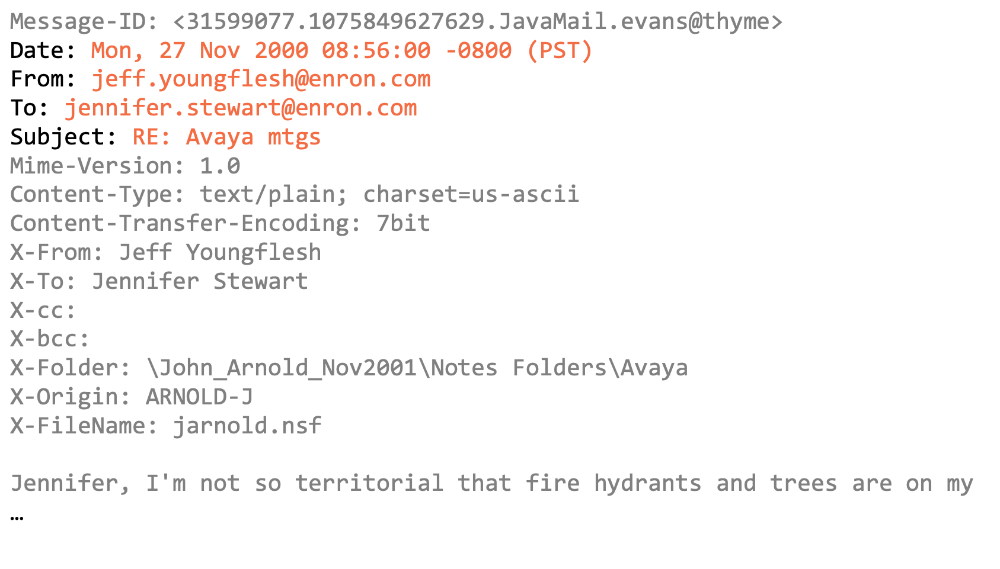

The grayed out stuff is what we can ignore in order to build the data frame. The orange is the data we need to extract and the black text is the set of sentinels we must look for to extract the data. This is more or less easy to extract because everything is on a line by itself with clear line prefixes. Unfortunately, sometimes there's a long `To:` list and the email recipient list spans multiple lines so you will have to deal with that as well:

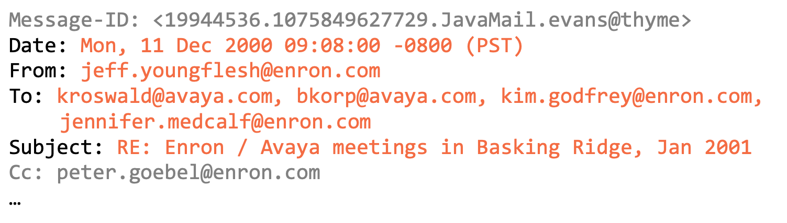

We'll also ignore the `CC:` and `BCC:` lines.  The `X-From:` etc... lines should be ignored for our purposes. All we need can be derived from the four headers  highlighted in orange.

Many of the email messages should be ignored. There are messages that have no `To:` line, which we can discard.  Ignore sender and recipient email addresses that are not Enron related, such as `tradersnewsindexes@ipgdirect.com`, `pep <performance.>`, and `dbaughman@houston.rr.com`.  Naturally, ignore any email message that has empty sender or recipient values after filtering.  Some addresses are from Enron but are weird and we should filter them out:

* `/o=enron/ou=eu/cn=recipients/cn=jtaylo3...@enron.com`
* `#32@enron.com`
* `legal<.hall@enron.com>`
* `e-mail<.bo@enron.com>`

Normalize the email addresses by getting rid of single quotes and delete any `.` (dot) at the start of an email address:
 
* `'.''bill@enron.com` &rightarrow; `bill@enron.com`
* `'arnold@enron.com` &rightarrow; `arnold@enron.com`
* `'.'delaney@enron.com` &rightarrow; `delaney@enron.com`

As a final detail, the date strings contained in the email messages must be converted to `datetime` objects and then stripped to just plain dates. (See the sample data frame above.) I found the easiest way was to add date strings to the data frame and then use pandas to convert to a plain date object. Here are the appropriate column datatypes:

```
 #   Column      Dtype 
---  ------      ----- 
 0   MailID      int64 
 1   Date        object
 2   From        object
 3   To          object
 4   Recipients  int64 
 5   Subject     object
 6   filename    object
```

The type of the `Date` column shows as `object` for some reason but if you actually look at the elements with, say, `df['Date'][0]`, you get: `datetime.date(2001, 5, 14)`.

### Building the script

My approach to this problem was to simply write code that I knew I was going to throw away, in order to explore the email messages and the structure of the data. That's how I figured out what we should ignore and what we should filter and normalize. I ended up with a big junk drawer of code with all sorts of commented out sections from previous experiments. Once I built something that worked properly, I reorganized it into multiple methods that made it much easier to understand and simpler to debug.  This is an important step when you're developing code commercially because someone, possibly you, must maintain this code in the future. The better structured it is, the easier it will be to maintain. *Always be good to your future self.* To get an idea of my code structure before and after, consider the following to blurred code outlines.

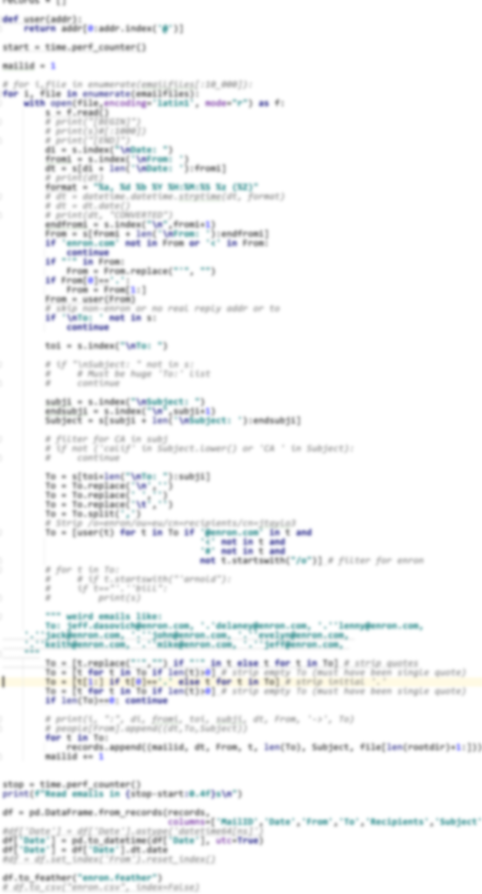&nbsp;&nbsp;&nbsp;&nbsp;&nbsp;&nbsp;&nbsp;&nbsp;&nbsp;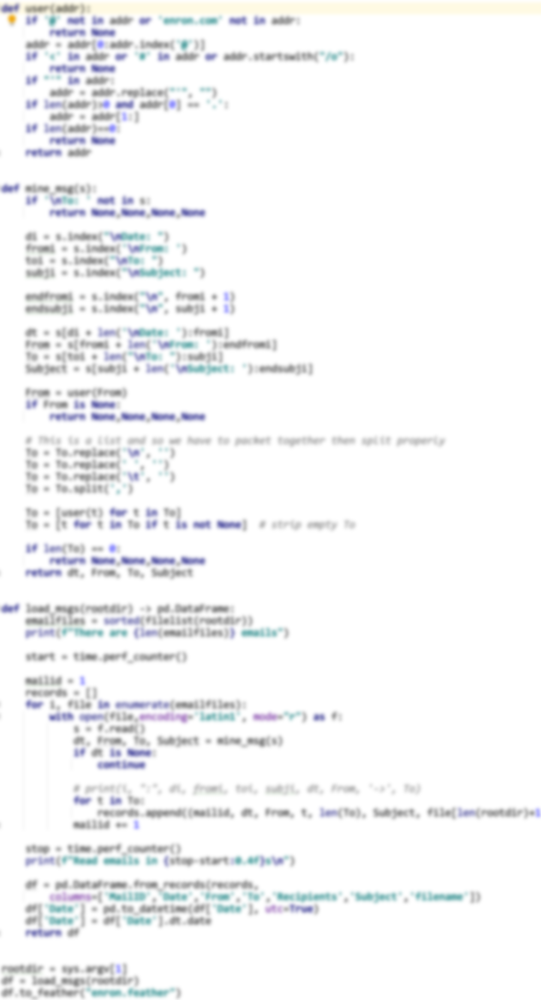

My structured code is organized well. For example, my main program (at the bottom) consists of code to essentially process all of the email into a data frame and then save it. Processing all of the email means getting a list of all message files and then loading those files one by one. As I load, I filter and normalize the information into a list of records (tuples). My primary method then converts that to a data frame and returns it to the main program, which saves it in feather format. I also have a method to extract the relevant bits from an email message and a method to normalize an email address.

You can structure your code anyway you want, but it must save the `enron.feather` file in the current working directory. That way my `test_enron.py` tests will find the data file.

As another test, see [enron-5000.csv](https://github.com/parrt/msds501/blob/master/projects/enron-5000.csv) which is the first 5000 after sorting by date and then by mail ID. The code to generate it is:

```python
df.sort_values(['Date','MailID']).head(5000).to_csv("enron-5000.csv")
```

You should compare this CSV file with what you generate. It starts like this:

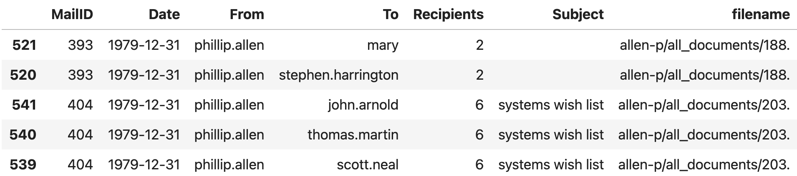

## Exploring email traffic

Fill out the notebook file called `enron.ipynd` located in the root of your repository so that it includes the explorations and visualizations mentioned in this section. Please begin with the [notebook starter kit](https://github.com/parrt/msds501/blob/master/projects/enron.ipynb).

### Email traffic over time

Group the data set by `Date` and `MailID`, which will get you an index that collects all of the unique mail IDs per date. Then reset the index so that those  date and mail identifiers become columns and then select for just those columns; we don't actually care about the counts created by the `groupby` (that was just to get the index).  Create a histogram that shows the amount of traffic per day. Then specifically for email sent from `richard.shapiro` and then `john.lavorato`. Because some dates are set improperly (to 1980), filter for dates greater than January 1, 1999. The graphs should look like this in your notebook:

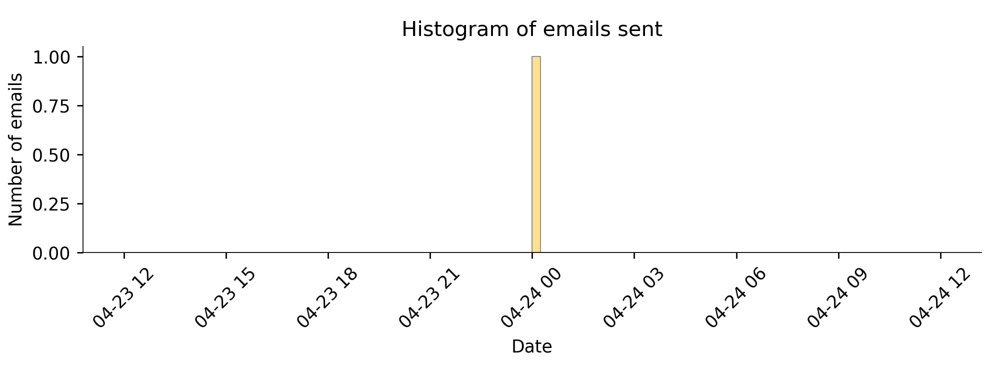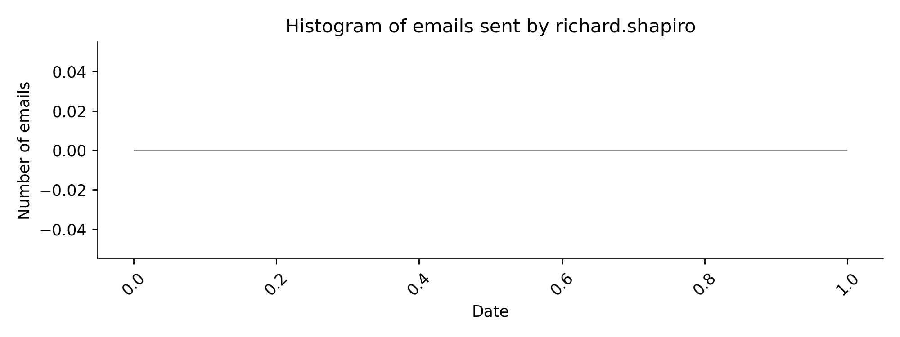<br>
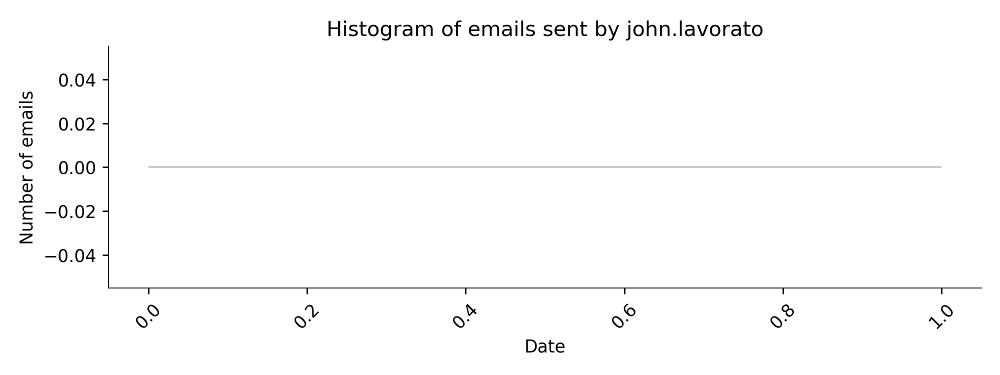

### Histogram of email messages sent and received

You need to create two bar charts:
 
1. Count the number of messages received per user and then sort in reverse order.
2. Make a bar chart showing the top 30 email recipients. Second, Make a bar chart indicating the top 30 mail senders. This is more complicated than the received emails because a single person can email multiple people in a single email. So,  group by `From` and `MailID`, convert the index back to columns and then group again by `From` and get the count.

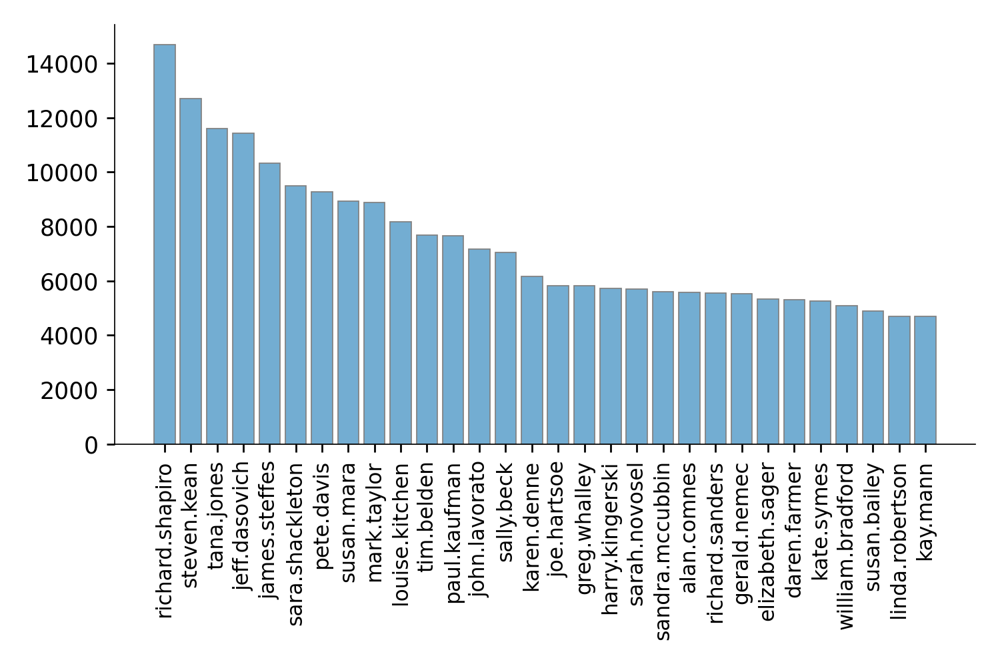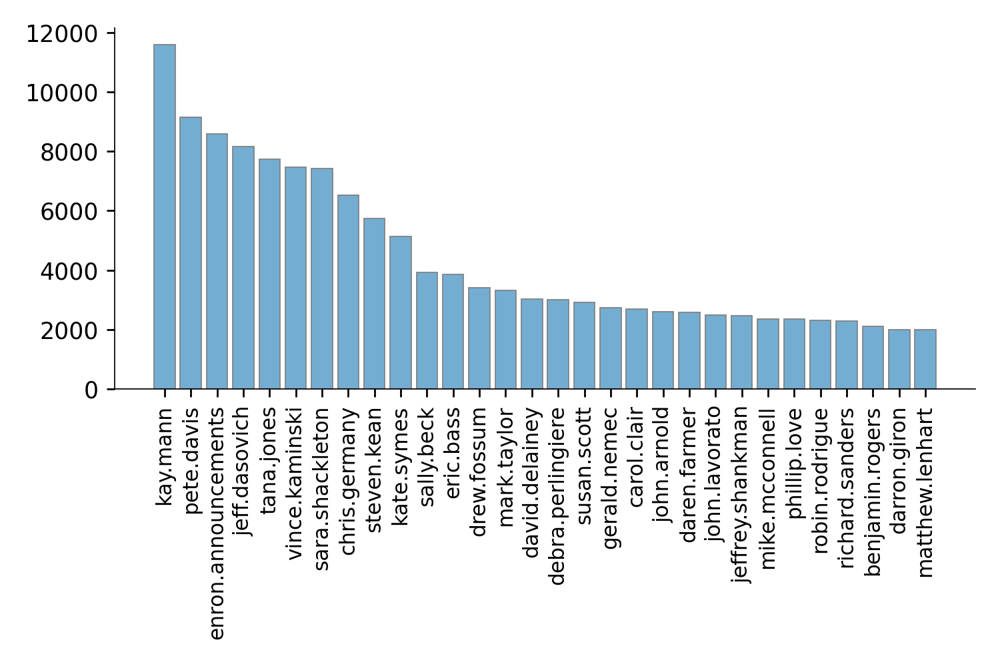

### Heatmap showing number of email messages between employees

Given a list of Enron employees, compute a heat map that indicates how much email traffic went between each pair of employees. The heat map is not symmetric because Susan sending mail to Xue is not the same thing as Xue sending mail to Susan. The first step is to group the data frame by `From` and `To` columns in order to get the number of emails from person i to person j. Then, create a 2D numpy matrix, C, of integers and set C[i,j] to the count of person i to person j emails. Using matplotlib, `ax.imshow(C, cmap='GnBu', vmax=4000)`, show the heat map and add tick labels at 45 degrees for the X axis. Set the labels to the appropriate names.   Draw the number of emails in the appropriate cells of the heat map, for all values greater than zero. Please note that when you draw text using `ax.text()`, the coordinates are X,Y whereas the coordinates in the C matrix are row,column so you will have to flip the coordinates.

```python
people = ['jeff.skilling', 'kenneth.lay', 'louise.kitchen', 'tana.jones',
          'sara.shackleton', 'vince.kaminski', 'sally.beck', 'john.lavorato',
          'mark.taylor', 'greg.whalley', 'jeff.dasovich', 'steven.kean',
          'chris.germany', 'mike.mcconnell', 'benjamin.rogers', 'j.kaminski',
          'stanley.horton', 'a..shankman', 'richard.shapiro']
```                 


## Exploring email connection graph

From the data frame, create a graph data structure using [networkx](https://networkx.org/), which you must install with `pip`. Create an edge from node A to node B if there is an email from A to B in the data frame. Although we do know the total number of emails between people, let's keep it simple and use simply a weight of 1 as the edge label. See networkx method `add_edge()`. Once you have created the graph object, you can't compute interesting statistics and make visualizations.

### PageRank between users

Using networkx, compute the pagerank between all nodes. Get the data into a data frame, sort in reverse order, and display the top 15 users from the data frame. 

(I use `DataFrame.from_dict` to convert the dictionaries returned from the various networkx methods to data frames.)

```
                 PageRank
jeff.skilling    0.004942
kenneth.lay      0.004559
louise.kitchen   0.004472
tana.jones       0.004291
sara.shackleton  0.004002
vince.kaminski   0.003817
sally.beck       0.003567
john.lavorato    0.003448
gerald.nemec     0.002698
rod.hayslett     0.002528
mark.taylor      0.002501
greg.whalley     0.002270
jeff.dasovich    0.002259
daren.farmer     0.001996
steven.kean      0.001988
```

The PageRank indicates the most "important" people, as computed by the number of outgoing and incoming email for a particular user. Without having to do any thinking, it quickly pops up the executives near the top of the list. A nice trick.

### Measuring centrality of users

Compute the centrality for the nodes of the graph. The documentation says that centrality is "*the fraction of nodes it is connected to.*"

```
                  Centrality
sally.beck          0.087738
outlook.team        0.081967
david.forster       0.079567
kenneth.lay         0.075788
technology.enron    0.063327
jeff.skilling       0.057964
tana.jones          0.054747
louise.kitchen      0.053215
jeff.dasovich       0.048721
sara.shackleton     0.047750
tracey.kozadinos    0.047138
john.lavorato       0.046627
julie.clyatt        0.045605
bodyshop            0.044686
david.oxley         0.043563
```

### Visualizing graph subsets

The email graph is way too large to display the whole thing and get any meaningful information out. However, we can look at subsets of the graph such as the neighbors of a specific node. To visualize it we can use different strategies to layout the nodes. In this case, we will use two different layout strategies: *spring* and *kamada-kawai*. According to
[Wikipedia](https://en.wikipedia.org/wiki/Force-directed_graph_drawing), these force directed layout strategies have the characteristic that: "*...the edges tend to have uniform length (because of the spring forces), and nodes that are not connected by an edge tend to be drawn further apart...*".  

Use networkx `ego_graph()` method to get a radius=1 neighborhood around `jeff.skilling` and draw the spring graph with a plot that is 20x20 inch so we can see details.  Then, draw the same subgraph again using the kamada-kawai layout strategy. Finally, get the neighborhood around kenneth.lay and draw kamada-kawai. The graph plots should look like this:

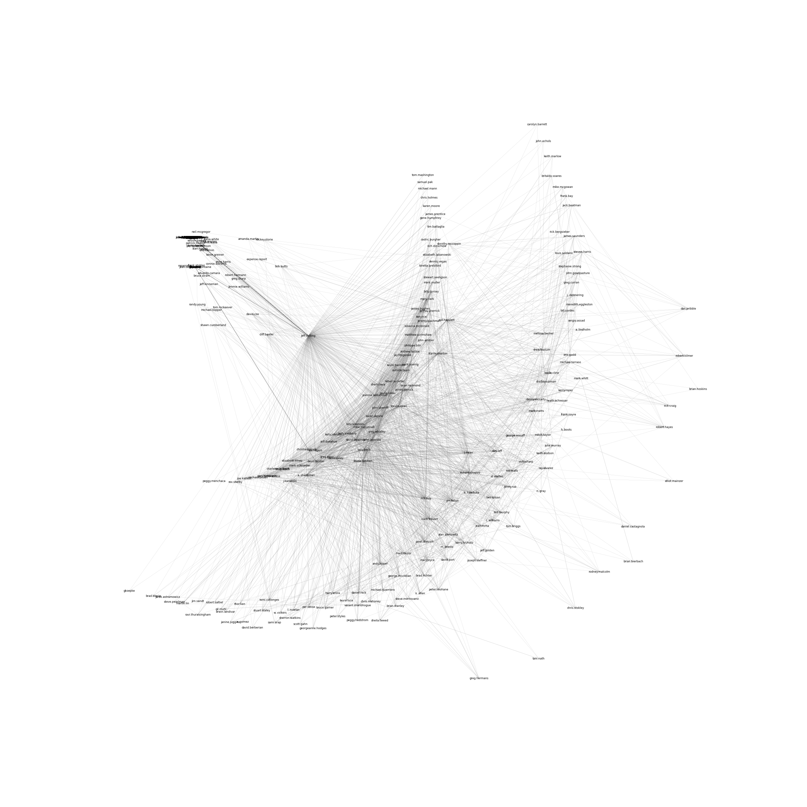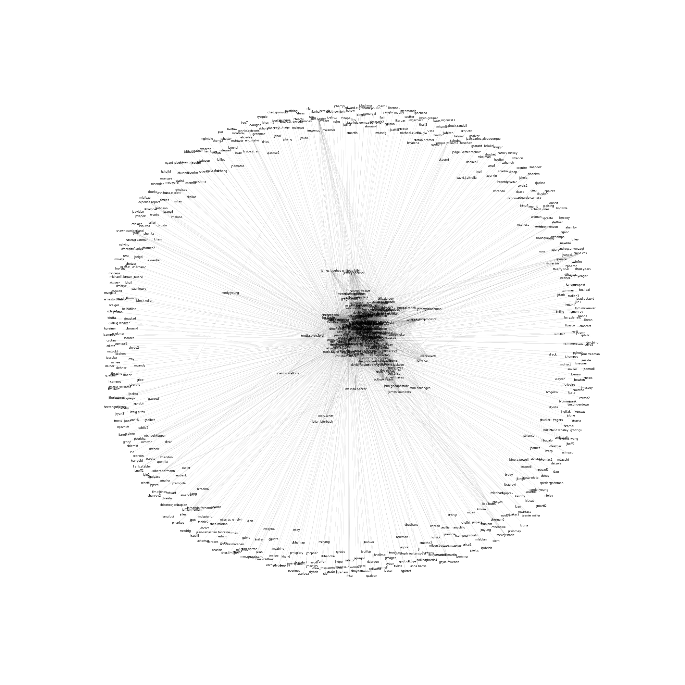

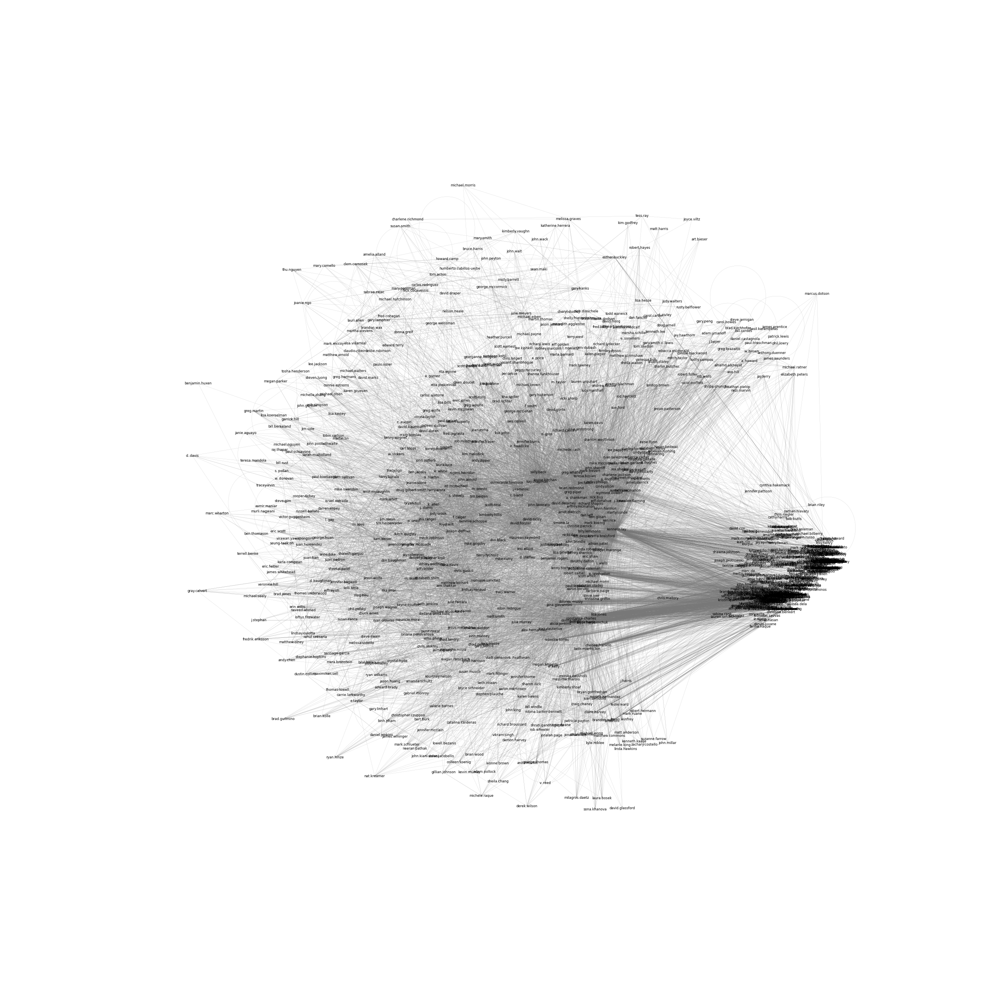

## Deliverables

In your repository, you should submit the following files in the root of the repository:

* `condense.py` This is the script that reads all of the emails and creates the handy data frame in feather format, storing the feather file in the current working directory.
* `enron.ipynb` Follow the [starter kit](https://github.com/parrt/msds501/blob/master/projects/enron.ipynb) of the notebook and generate the appropriate explorations and visualizations
* `enron.pdf` This is the PDF exported or generated from the notebook.

The easiest way to generate `enron.pdf` is to use `jupyter-nbconvert`, as you did in the images project:

```bash
$ pip install -U notebook-as-pdf
$ jupyter-nbconvert --to PDFviaHTML enron.ipynb
```

## Evaluation

I will execute your `condense.py` script from the command line with an argument indicating where I have my `maildir` directory. For example, I probably will execute it like this:

```python
$ python condense.py ~/data/maildir
...
```

**Execution time of condense.py to create enron.feather must be under 3.5 minutes on my machine to get credit for the project.**  It must also leave the `enron.feather` file in the current directory so that the unit tests know how to find the file.

I will test the contents of `enron.feather` using the [test_enron.py](https://github.com/parrt/msds501/blob/master/projects/test_enron.py) test rig:

```bash
$ python -m pytest -v test_enron.py
================================= test session starts =================================
platform darwin -- Python 3.8.8, pytest-6.2.3, py-1.10.0, pluggy-0.13.1 -- /Users/parrt/opt/anaconda3/bin/python
cachedir: .pytest_cache
rootdir: /Users/parrt/courses/msds501-private/projects/enron
plugins: anyio-2.2.0
collected 6 items                                                                     

test_enron.py::test_overall_stats PASSED                                        [ 16%]
test_enron.py::test_addrs PASSED                                                [ 33%]
test_enron.py::test_lavorato_filenames PASSED                                   [ 50%]
test_enron.py::test_kay_mann PASSED                                             [ 66%]
test_enron.py::test_tim_johanson PASSED                                         [ 83%]
test_enron.py::test_ken_lay_senders PASSED                                      [100%]

================================= 6 passed in 15.05s ==================================
```

And finally, I will take a look at the `enron.pdf` file to verify you have created the proper output. I will also likely have my script use `jupyter-nbconvert` to generate a PDF to make sure the code executes properly in the notebook.
