# Image Processing

The goal of this project is to exercise your understanding of all of the major components in Python: assignments, expressions, if and loop statements, functions, lists, and libraries. To make things interesting, we will perform some cool image processing tasks:

* flipping horizontally
* blurring
* removing salt-and-pepper image noise
* finding edges within images
* image sharpening

For example, here is a sharpened image before/after:

 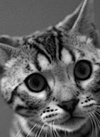

## Starter kit and expected output

I have provided a Jupyter Lab notebook for you to use as a [starter kit](https://github.com/parrt/msan501/blob/master/projects/images-starterkit.ipynb). You should save that file into the main directory associated with your repository and then make edits to it. That is the file you will edit and submit for grading.  It looks like this when run as a notebook in jupyter lab:

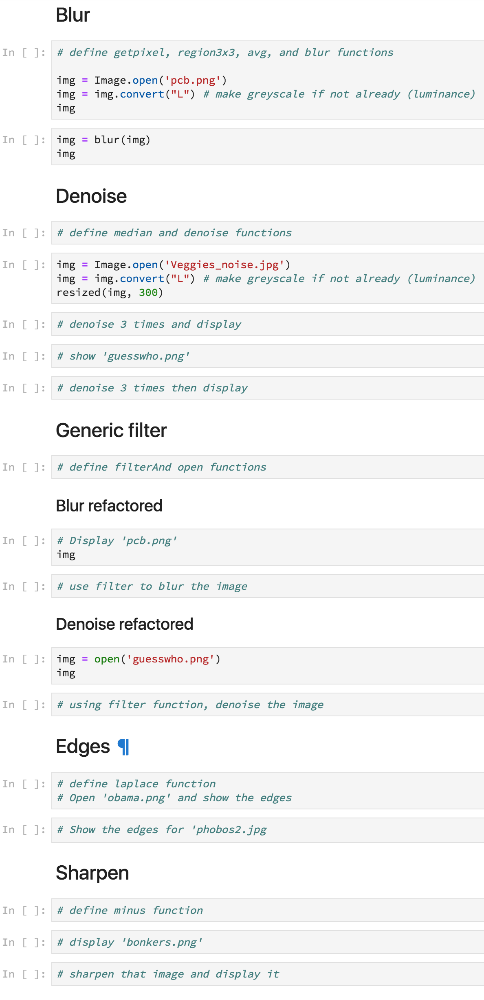

You can find all of the [expected images](https://github.com/parrt/msan501/blob/master/projects/images-expected-output.zip?raw=true) generated by this project in the repository.

## Git from the command line

Let's prepare our programming environment so that submitting this project is easy.  This process is abbreviated here, but you can see it fleshed out in more detail in the section "Getting Started On The Images Project" of the [git lecture](https://github.com/parrt/msan501/blob/master/notes/git.md).

I will post to slack or via the students email list a URL for each project that represents an invitation to create a repository associated with a specific project for this class. Each student will have their own private repository per project. Once you have created the repository, you can proceed with this section to clone that empty repository onto your laptop disk.

Launch Terminal.app or whatever your bash shell is called on your system. Now, using a browser, go to the URL associated with your images project at github, which should be something like (*YOURID* is your github user name not your laptop username or your USF username): 

https://github.com/YOURID/images-YOURID

and copy the **HTTPS not SSH** URL from here:


Then, use the `git clone `command as you see below, replacing `images-parrt` with images-*yourid*. You will have to type in your github user ID and password.

```bash
$ cd ~/msan501 #  assuming this is where you want the root of all of 501 projects
 git clone https://github.com/USF-MSAN501/images-parrt.git
Cloning into 'images-parrt'...
Username for 'https://github.com': parrt
Password for 'https://parrt@github.com': 
warning: You appear to have cloned an empty repository.
$ cd images-parrt # after this command you are now in your repository
```

There is nothing in the repo yet, but we'll get to it!

## Getting started

The first thing we have to do is get the starter kit into the directory associated with your repository. The repository can only track files that live underneath the images-*yourid* directory (and we have to tell it to track files of interest). Save the [starter kit](https://github.com/parrt/msan501/blob/master/projects/images-starterkit.ipynb) as file **images.ipynb** to your equivalent of `~/msan501/images-parrt` directory. (Rename the starter kit to be **images.ipynb**.)

Once you have saved that file, you need to add it to the repository. Remember that the repository does not track any file you don't tell it to track:

```bash
$ git add images.ipynb
```

Next, download the [images zip file](https://github.com/parrt/msan501/blob/master/projects/images-expected-output.zip?raw=true) into that directory and unzip it. Add all image files to the repo.

```bash
$ git add *.jpg
$ git add *.png
```

*Do not add the zip file to the repository*.

Now that we have told the repository to track those files, we need to commit that transaction:

```bash
$ git commit -a -m 'Initial add of starter kit'
...
```

That has committed your change (addition of files) to the local repository and now you need to push it back to github, the remote repository:

```bash
$ git push origin master
...
```

Go make sure that github has the file. The web page for your repository should look like the following:


Next, fire up Jupyter Lab *in the directory holding your images.ipynb file*:

```bash
$ cd ~/msan501/images-parrt
$ jupyter lab
...
```

This will launch a new tab in your browser.  From the file pane on the left, select the file `images.ipynb` and it will show you the skeleton that you need to fill-in as part of the project.

I have provided a number of [images](https://github.com/parrt/msan501/tree/master/projects/figures) that you can use to play around with this project. Of course, you can use any others you want. (Remember, however, that all images used in this class and those stored on University equipment must be "safe for work." Keep it G-rated please, with no offensive images popping up on your laptops or machines during lab etc.)

## Task 0. Viewing file in a notebook

To get started, go to the **View** section of the starter kit and try to run the code in that section.

```python
from PIL import Image
img = Image.open('eye.png')
img = img.convert("L") # grayscale
img   # same as display(img)
```

It should display the eyeballs like this:


That code shows you how to open an image file, convert it to grayscale, and display the image by simply referencing the `img` variable.  That is shorthand for explicitly telling the notebook to display that object: `display(img)`.

If you do `img.show()`, than a separate window will pop up instead of showing it in line in the notebook.

## Task 1. Flipping an image horizontally

As a first task, create a function, `flip`, and a code snippet that calls that function under the **Flip** section of the starter kit that shows eyeballs image, `eye.png`, flipped horizontally.  Here are the before and after shots for your reference:

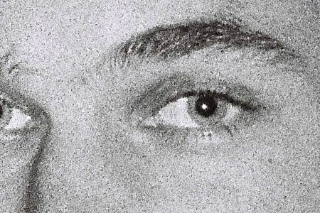 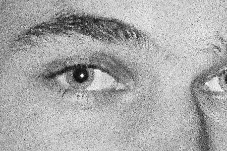

Let's look at the functionality we need to create the `flip` function, since you just learned how to open and display an image.

### Three new image library pieces

To write your `flip` function, you will need three basic pieces:

<ul>
<li> <tt>img.size</tt> returns a tuple containing the width and height of image <tt>img</tt> so you can write code like this:

```python
width, height = img.size
```
You'll need the width and height to iterate over the pixels of the image.

<li> <tt>img.copy()</tt> duplicates image <tt>img</tt>.  For our <tt>flip</tt> function, it would be hard to modify the image in place because we would be overwriting pixels we would need to flip later. It's easier to create a copy of the image in flipped position. You can write code like this: <tt>imgdup = img.copy()</tt>

<li> <tt>img.load()</tt> is yet another weird name from PIL that actually returns an object that looks like a two-dimensional matrix, which is really just a list of lists such as <tt>m = [[1,2], [3, 4]]</tt>. When printed, the output looks like a matrix:

```python
m = [[1, 2],
     [3, 4]]
```
To get element <tt>3</tt>, we would use list index expression <tt>m[1][0]</tt> because we want the list at index 1, <tt>m[1]</tt>, and then element 0 within that list. The two-dimensional object returned by <tt>load()</tt> uses similar notation. If we ask for the "matrix" with:

```python
m = img.load()
```
then we  use notation <tt>m[x,y]</tt> to get the pixel at position (<tt>x</tt>, <tt>y</tt>). As is usual with Cartesian coordinates, the <tt>x</tt> index is the horizontal index.
</ul>

You will use these functions for the remaining tasks so keep them in mind.

### Iterating over the image matrix

**Define function** `flip` using the familiar function definition syntax and have it take a parameter called `img`, which will be the image we want to flip. The goal is to create a copy of this image, flip it, and return a copy so that we do not alter the incoming original image. To create `flip`, write code that implements the following steps.

<ol>
<li> Use <tt>size</tt> to define local variables <tt>width</tt> and <tt>height</tt>
<li> Use <tt>copy()</tt> to make a copy of the incoming image <tt>img</tt> and save it in a local variable
<li> Use <tt>load()</tt> to get the two-dimensional pixel matrix out of the incoming image and the copy of the image. Store these results in two new local variables.
<li> To walk over the two-dimensional image, we've learned we need every combination of <tt>x</tt> and <tt>y</tt>. That means we need a nested <tt>for</tt> loop. Create a nested for loop that iterates over all <tt>x</tt> and all <tt>y</tt> values within the <tt>width</tt> and <tt>height</tt> of the image.
<li> Within the inner loop, set pixels in the image copy to the appropriate pixel copied from the original image
<li> At the end of the function, return the flipped image
</ol>

The only remaining issue is determining which pixel from the original image to copy into the (`x`, `y`) position in the image copy. The `y` index will be the same since we are flipping horizontally. The `x` index in the flipped image is index `width-x-1` from the original image. Trying out a few sample indexes shows that this works well. For example, a flipped image with `width=10` has its pixel at `x=0` pulled from index `x=10-0-1=9` in the original image. That's great, because it takes the image from all in the right in the original and copies it to the far left of the copy. Checking the opposite extreme, `x=9` in the flipped image should be `x=10-9-1=0` from the original image.

### What to do when the program doesn't work

If you have problems, follow these steps:

<ol>
<li> Don't Panic! Relax and realize that you will solve this problem, even if it takes a little bit of messing around. Banging your head against the computer is part of your job. Remember that the computer is doing precisely what you tell it to do. There is no mystery.

<li>  Determine precisely what is going on. Did you get an error message from Python?  Is it a syntax error? If so, review the syntax of all your statements and expressions.  If you got an error message that has what we call a stack trace, a number of things could be wrong. For example, if I misspell `open()` as `opem()`, I get the following message:

```
---------------------------------------------------------------------------
AttributeError                            Traceback (most recent call last)
<ipython-input-39-86d19b3216b2> in <module>()
      1 from PIL import Image
      2 
----> 3 img = Image.opem('eye.png')
      4 img = img.convert("L") # grayscale
      5 img

AttributeError: module 'PIL.Image' has no attribute 'opem'
```

<li> If it does not look like it some simple misspelling, you might get lucky and find something in Google if you cut-and-paste that error message.
<li> If your script shows the original image but not the flipped image, then you likely have a problem with your `flip` function.
<li> If your code is at least running and doing something, then insert print statements to figure out what the variables are and how far into the program you get before a craps out. That often tells you what the problem is.
<li>  Definitely try to solve the problem yourself, but don't waste too much time. I can typically help you out quickly so you can move forward.
</ol>

**Deliverables**. Make sure that your `images.ipynb` file is correctly committed to your repository and pushed to github. Verify this by going to github website. Make sure that it is in the main directory and not a subdirectory of your repository!!!

## Task 2. Blurring

In this task, we want to blur an image by removing detail as shown in the images after this paragraph. We will do this by creating a new image whose pixels are the average of the surrounding pixels for which we will use a 3x3 region as shown in the figure below zooming in on Obama's forehead. The pixel in the center of the region is the region to compute as we slide the region around an image. In other words, `pixel[x,y]` is the sum of `pixel[x,y]` and all surrounding pixels divided by 9, the total number of pixels.

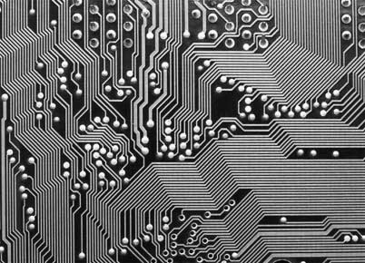 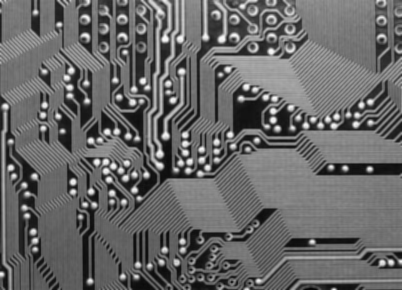

To implement this, fill in the **Blur** section of the starterkit. The only difference is that you must call soon-to-be-created function `blur` not `flip` as you had before. Now, let's start at the coarsest-level of functionality and realize that we have to walk over every pixel in the image. (This is called *top-down design*.) 

### Blurring function

**Define function** `blur`, in the cell under section **Blur** of the starter kit, to take an `img` parameter, just like the `flip` function in the previous task.  In a manner very similar to `flip`, write code in `blur` to accomplish these steps:

* Define local variables `width` and `height`.
* Make a copy of the incoming image `img` and save it in a local variable.
* Get the two-dimensional pixel matrix out of the image copy. Store it in a new local variable called `pixels`.
* Create a nested for loop that iterates over all `x` and all `y` values within the `width` and `height` of the image.
* Within the inner loop:
   * Call to-be-created function `region3x3` with arguments `img`, `x`, and `y` in store into local variable `r`.
   * Set `pixels[x,y]` in the image copy to the result of calling to-be-created function `avg` with an argument of `r`.
* At the end of the function, return the blurred image.

**Define function** `avg` to take an argument called `data` or another of your choice. This will be the list of 9 pixels returned by function `region3x3`. The average of a set of numbers is their total divided by how many numbers there are. Python provides two useful functions here: `sum(data)` and `len(data)`.  (Naturally, `sum` simply walks the list and accumulates values using a pattern we are familiar with.)  Make sure that this function returns an integer using `int(...)`.

### Image regions

Now we need to **define function** `region3x3`.  Have it take three parameters as described above. This function creates and **return a list of nine pixels**. The list includes the center pixel at `x`, `y` and the 8 adjacent pixels at N, S, E, W, ... as shown in the following figure.

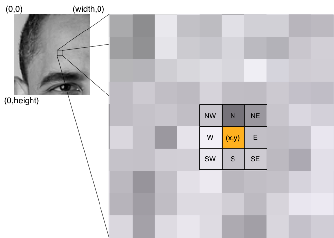

Create a series of assignments that look like this:
 
```python
me = getpixel(img, x, y)
N = getpixel(img, x, y - 1)
...
```

where function `getpixel(img, x, y)` gets the pixel at `x`, `y` in image `img`.  We can't use the more readable expression `pixels[x,y]` in this case, as we'll see in a second. Collect all those pixel values into a list using `[a,b,c,...]` list literal notation and return it. Make sure that this list is a list of integers and exactly 9 elements long and that you keep in mind the order in which you add these pixels to the list. Any function that we create to operate on a region naturally needs to know the order so we can properly extract pixels from the list. For example, my implementation always puts the pixel at `x` and `y` first, then North, etc...

### Safely examining region pixels

We need to **define a function** `getpixel` instead of directly accessing pixels because some of the pixels in our 3x3 region will be outside of the image as we shift the region around. For example, when we start out at `x=0`, `y=0`, 5 of the pixels will be out of range, as shown in the following figure.

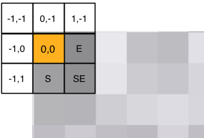

Accessing `pixels[-1,-1]` will trigger:
  
`IndexError: image index out of range`

and stop the program. To avoid this error and provide a suitable definition for the ill-defined pixels on the edges, we will use a function that ensures all indices are within range.

**Define function** `getpixel` with the appropriate parameters. Its functionality is as follows:

* Get the width and height into local variables.
* If the `x` value is less than 0, set it to 0.
* If the `x` value is greater than or equal to the width, set it to the width minus 1 (the last  valid pixel on the far right).
* If the `y` value is less than 0, set it to 0.
* If the `y` value is greater than or equal to the height, set it to the  height minus 1 (the last felt pixel on the bottom).
* Return the pixel at `x`, `y`. You will need to use the `img.load()` function again to get the 2D `pixels` matrix as you did in function `blur`. Make sure you returning pixel and not the coordinates of the pixel from `getpixel`.


### Testing your blur code

That is a lot of code to enter and so more than likely it won't work the first time. (It never does, dang it!) That means we should test the pieces. It's generally a good idea to do top-down design but *bottom-up testing*. In other words, let's test the simple low-level functions first and make sure that works before testing the functions that call those functions and so on until we reach the outermost script. 

With that in mind, lets test `avg` by passing it a fixed list of numbers to see if we get the right number.  You can split up the functions you created so they all exist within their own cells. Then you can test out the `avg` function with something like this:

```python
avg([1,2,3,4,5])
```

If it does not print `(1+2+3+4+5)/5` = `3`, then you know you have a problem in `avg`.

Now test `getpixel`. You will have to insert some code after loading and converting the image to grayscale because `getpixel` takes an image parameter. Here's how to try it out on the circuit board image:

```python
img = Image.open("pcb.png")
img = img.convert("L")
print(getpixel(img, 0, 0))
print(getpixel(img, 0, 1))
print(getpixel(img, 10, 20))
```

That should print: 222, 181, and 44. The upper left corner is near white and pixel 10, 20 is close to black. If you don't get those numbers, then you have a problem with `getpixel`. Worse, if you don't get a number (e.g., you get a list), then you really have a problem with `getpixel`.

Before getting to `blur`, we should also **test** `region3x3` to ensure it gets the proper region surrounding a pixel. Replace those `getpixel` calls in the `print` `getpixel` statements with calls to `region3x3`. Use the `x`, `y` of the upper left-hand corner and somewhere near the upper left of the white section of the logo such as:

```python
print(region3x3(img, 0, 0))
print(region3x3(img, 7, 12))
```

That checks whether we get an out of range error at the margins and that we get the correct region from somewhere in the middle. Running the cell with that code snippet should give you the following numbers:

```
[222, 222, 181, 187, 222, 222, 187, 234, 181]
[31, 31, 32, 167, 176, 166, 165, 164, 175]
```

That assumes order: current pixel, N, S, E, W, NW, NE, SE, SW.

When you have verified that all of these functions work, it's time to check function `blur` itself. Try the printed circuit board image, which would look like the right image in the intro paragraph for this task.

It might take 10 seconds or more to compute and display the blurred image, depending on how fast your computer is.


Make sure to remove all of your debugging code before submitting your scripts. Submitting a project that prints out a bunch of random debugging output is considered sloppy, like submitting an English paper with a bunch of handwritten edits.

**Deliverables**. Make sure that `images.ipynb` is correctly committed to your repository and pushed to github. Make sure that all of your changes are there.

## Task 3. Removing noise

For our next task, we are going to de-noise (remove noise) from an image as shown in the following four figures. It does a shockingly good job considering the simplicity of our approach. To blur, we used the average of all pixels in the region. To denoise, we will use the [median](http://en.wikipedia.org/wiki/Median), which is just the middle value in a list of ordered numbers (or average of two middle if there are an even number of values).

<table border="0">
<tr>
<td>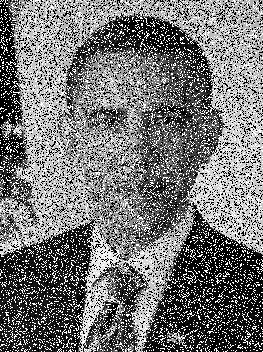<td>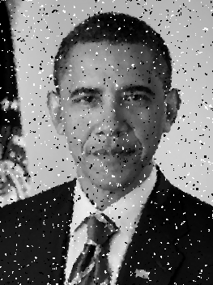
<tr>
<td><td>
</table>

Believe it or not, we can implement de-noise by copying our blur code into a new cell under section **Denoise** in the starter kit and then changing a few lines.  We also have to remove the no-longer-used `avg` function and replace it with a `median` function.  Of course, instead of calling `blur`, we'll call function `denoise` with the usual `img` argument. The only difference between `denoise` and `blur` is that you will set the pixel to the `median` not `avg`.  Hint: you need to tweak one statement in the inner loop that moves over all pixel values.

**Define function** `median` that, like `avg`, takes a list of 9 numbers called `data`. Sort the list using Python's `sorted` function, which takes a list and returns a sorted version of that list. Then compute the index of the middle list element, which is just the length of the list divided by two. If the length is even, dividing by 2 (not 2.0) will round it down to the nearest index. Once you have this index, return the element at that index. Make sure that this function returns an integer using `int(...)`.

In a code cell,  open file `Veggies_noise.jpg`, display it, then pass it to `denoise` three times, each time sending the previous return result in as a parameter.  The two images should look like:

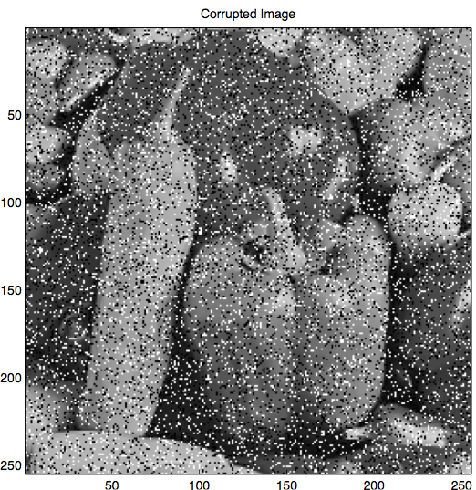 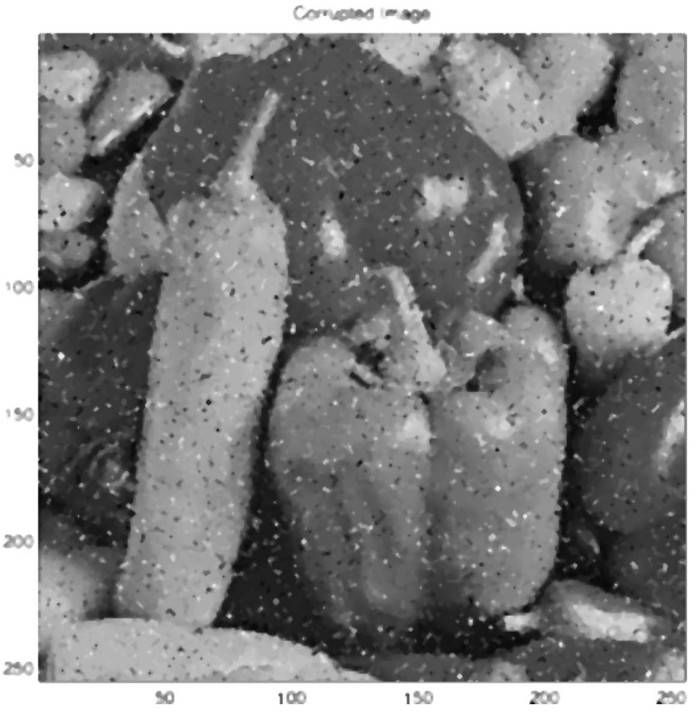

In a code cell,  open file `guesswho.png`, display it, then pass it to `denoise`. That should show the noisy Obama and the cleaned up version.  You can call `denoise` multiple times to really clean it up.  Running `denoise` twice, gives the cleaned up (third) Obama image above.  

**Deliverables**. Make sure that you have your code and appropriate images displayed in your `images.ipynb` notebook and that it is correctly committed to your repository and pushed to github.

## Task 4. Re-factoring to improve code quality

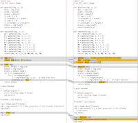
As I mentioned in the last task, blur and denoise are virtually identical, meaning that we have a lot of code in common. The side figure demonstrates this visually. One of the most important principles of computer science is to reduce code duplication. We always want exactly one place to change a particular bit of functionality.   In this case, we have the following common code:

* Functions `getpixel` and `region3x3`.
* The main part of the script that loads the original image.
* Functions `blur` and `denoise` are identical except for the function called to compute a new pixel in the image copy from a 3x3 region in the original (`avg` or `median`).

The goal of this task is to reuse as much of the same code as possible for blurring and denoising. Functions `getpixel` and `region3x3` are identical and are already available to us from the definition in previous notebook code cells. 

So, let's create a function called `open` to combines the open and convert function calls:

```python
def open(fname):
	img = Image.open(fname)
	img = img.convert("L")
	return img
```

That lets us do things like:

```python
img = open('pcb.png')
```

The only tricky bit (pun intended) is to create a single generic `filter` function that can reproduce the functionality we have in functions `blur` and `denoise`.

* Define function `filter` to take `img` and `f` parameters.
* Copy the body of function `blur` into your new `filter` function.
* Replace the call to `avg(r)` with `f(r)`.

As we discussed in class, functions are objects in Python just like any strings, lists, and so on. That means we can pass them around as function arguments. To use our new generic `filter` function, we pass it an image as usual but also the name of a function:

```python
blurred  = filter(img, avg)
denoised = filter(img, median)
```

<table border=1>
<tr><td>Don't confuse the name of a function with an expression that calls it.  Assignment <tt>f = avg</tt> makes variable <tt>f</tt> refer to function <tt>avg</tt>. <tt>f = avg()</tt> <b>calls</b> function <tt>avg</tt> and stores the return value in variable <tt>f</tt>. Using <tt>f = avg</tt>, we can call <tt>avg</tt> with expression <tt>f()</tt>. You can think of <tt>f</tt> as an alias for <tt>avg</tt>.
</table>

In the end, we now have 4 generically useful functions: `getpixel`, `region3x3`, `filter`, and `open`.

Armed with this awesome new common functionality, blurring and image shrinks to the following tiny script:

```python
img = open('some file')
img = filter(img, avg)		# blur me please
img                       # show me
```

Denoising is also tiny:

```python
img = open('some file')
img = filter(img, median)	# denoise me please
img
```

<table border=1>
<tr><td>Yep, these files are identical except for the fact that we call <tt>filter</tt> with different function names. If you wanted to get really fancy, you could replace both of these scripts with a single script that took a function name as a second argument (after the image filename).  With some magic incantations, you'd then ask Python to lookup the function with the indicated name and pass it to function <tt>filter</tt> instead of hard coding.
</table>

Before finishing this task, be a thorough programmer and test your new scripts to see that they work. Please add cells to show `pcb.png` and blur it. Then do the same for denoising `guesswho.png`.

They *should* work, but unfortunately that is never good enough in the programming world.  Lot of little things can go wrong. *Certainty* is always better than *likelihood*.

**Deliverables**. Make sure that you commit your appropriate changes and push the results back to the repository at github.

## Task 5. Highlighting image edges

Now that we have some basic machinery available to us in the form of some common functions, we can easily build new functionality. In this task, we want to highlight edges found within an image.  It is surprisingly easy to capture all of the important edges in an image:

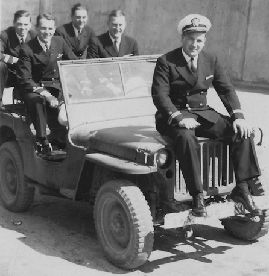 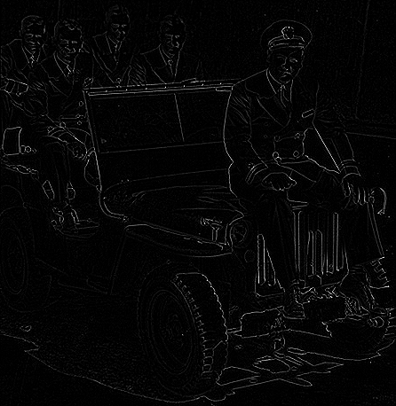

The mechanism we're going to use is derived from some serious calculus kung fu called the *Laplacian*, but which, in the end, reduces to 4 additions and a subtraction!  The intuition behind the Laplacian is that abrupt changes in brightness indicate edges, such as the transition from the darkness of a uniform to the brightness of a windshield edge.  As we did for blurring and denoising, we are going to slide a 3x3 region around the image to create new pixels at each `x`, `y`. That  means we can reuse our `filter` function---we just need a `laplace` function to pass to `filter`.

To get started, here is the boilerplate code you need to load and get the edges for Obama:

```python
# define function laplace here
...
img = open('obama.png')
display(img)
edges = filter(img, laplace)
edges
```

**Create function** `laplace` that takes region `data` as an argument as usual. Have the function body  return the sum of the North, South, East, and West pixels minus 4 times the middle pixel from our usual region:

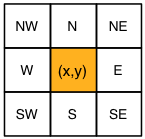

That computation effectively compares the strength of the current pixel with those around it. For example, imagine a region centered over a vertical white line. The region might look like:

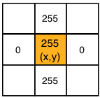

The `laplace` function would return 255+255+0+0 - 4 * 255 = -510. 


For those familiar with calculus, we are using the second partial derivative (i.e., acceleration) in x and y directions. The first derivative would detect edges even for gradual changes but the second derivative detects only really sharp changes. For a pixel fetching function <i>f</i> operating on a 3x3 region around <i>(x,y)</i>, "applying the <i>Laplacian</i>" means computing a filtered image pixel at <i>x,y</i> as:<br><i>f(x + 1,y) + f(x - 1,y) + f(x,y + 1) + f(x,y - 1) - 4f(x, y)</i><br>where <i>f(x,y)</i> is equivalent to our <tt>pixels[x,y]</tt>.

<table border=1>
<tr><td>Be aware of something that Pillow is doing for us automatically when we store values into an image with <tt>pixels[x,y] = v</tt>.  If <tt>v</tt> is out of range 0..255, Pillow clips <tt>v</tt>. So, for example, <tt>pixels[x,y] = -510</tt> behaves like <tt>pixels[x,y] = 0</tt> and <tt>pixels[x,y] = 510</tt> behaves like <tt>pixels[x,y] = 255</tt>. It doesn't affect edge detection or any of our other operations in future tasks but I wanted to point out that in a more advanced class we would <b>scale</b> these pixel values instead of clipping them. Clipping has the effect of reducing contrast.
</table>

Compare that to the opposite extreme where values are almost the same:

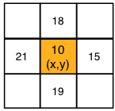

The `laplace` function would return 18+19+15+21 - 4 * 10 = 33.

Once you have implemented your `laplace` function, give it a try on images `obama.png` and `phobos2.jpg`. It actually does a really good job capturing Obama's outline:

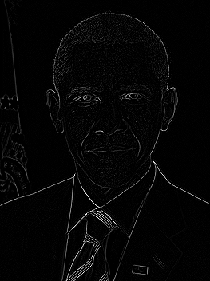

**Deliverables**. Make sure that you show the edges for Obama and the asteroid and have a correct `laplace` function in the appropriate section of `images.ipynb`. Make sure that the file is correctly committed to your repository and pushed to github. 


## Task 6. Sharpening

Sharpening an image is a matter of highlighting the edges, which we know how to compute from the previous task.  Now, let's work in the **Sharpen** section of the starter kit. Instead of just computing the edges, we *subtract* that white-on-black edges image from the original.  You might imagine that *adding* the edges back in would be more appropriate and it sort of works, but the edges are slightly off. We get a better image by subtracting the high-valued light pixels because that darkens the edges in the original image, such as between the uniform and the windshield. Let's start with the easy stuff:

 

* Reuse your previous code for detecting edges to load an image and apply the Laplace filter.
* After `edges = filter(img, laplace)`, add a line that calls a function we'll create shortly called `minus`. `minus` takes two image parameters, `A` and `B` and returns `A-B`.  In our case, pass in the original image and the image you get back from calling `filter(img, laplace)`.
* Show the image return result of the `minus` function.

That only leaves the task of **creating function** `minus` to subtract the pixels of one image from the pixels of another image like a 2-D matrix subtraction.  As we did before, we will return a modified version of a copy of an incoming image parameter. (In my solution, I arbitrarily chose to create and return a copy of `A`.) Because you are getting really good at creating functions to manipulate images, the instructions for creating `minus` in this  task are less specific than in previous tasks.  You need to fill in the body of this function:
 
```python
# Return a new image whose pixels are A[x,y] - B[x,y]
def minus(A, B):
	...
```

The mechanism is the same as before: iterating loop variables `x` and `y` across the entire image and processing the pixel at each location. The only difference between this function and `filter` is that we want to operate on individual pixels not 3x3 regions.  In the inner loop, set `pixels[x,y]` to the value of pixel `A[x,y]` minus pixel `B[x,y]`. Don't forget to return the image you filled in.

Add a cell to load and display `bonkers.png` then show the sharpened image.  Do the same for image `phobos2.jpg`.

This simple process of subtracting the Laplacian does an amazing job.  Here's the before and after photo of the asteroid:

 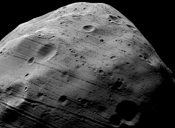

**Deliverables**. Make sure that your `images.ipynb` is correctly committed to your repository and pushed to github. 

## Expected results

For your reference, here is the expected sequence of images and sections with all of the code cells hidden (though the relative sizes of those images might be different in your output):

<table border="0">
<tr>
<td>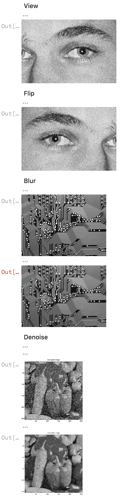
<td>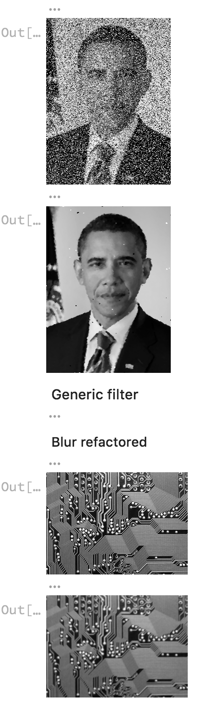
<td>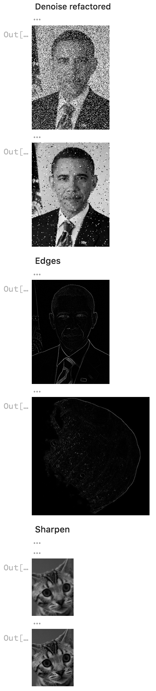
</table>
