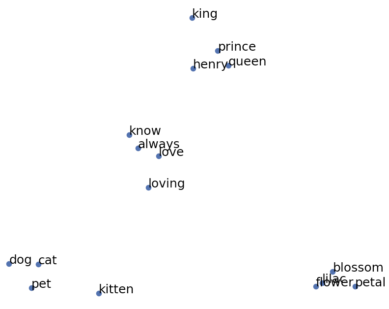
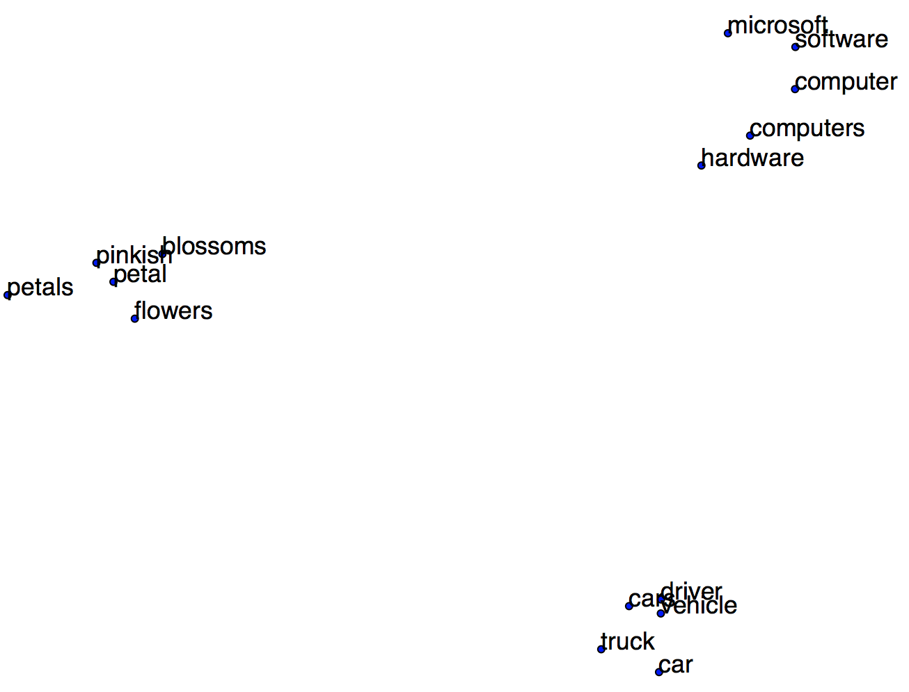

# Word similarity and relationships

## Goal

In this project, you will leverage a semi-recent advance in natural language processing called [word2vec](http://arxiv.org/pdf/1301.3781.pdf) (or just *word vectors*) to study the similarity between words. In particular, we're going to use a "database" from [Stanford's GloVe project](https://nlp.stanford.edu/projects/glove/).  For example, given a single word, we can find the *n* closest words:

```
Enter a word or 'x:y as z:'
> dog
dog is similar to {dogs cat pet puppy hound}
> cow
cow is similar to {cows mad bovine sheep goat}
> spain
spain is similar to {portugal spanish morocco madrid spaniards}
```

Given 3 words, we can also use word vector to fill in the blank of partial analogies of the form "*x is to y as z is to _____*":

```
Enter a word or 'x:y as z:'
> king:queen as man:
king is to queen as man is to {woman girl person teenager she}
> building:architect as software:
building is to architect as software is to {programmer architect designer computer microsoft}
> german:english as french:
german is to english as french is to {english welsh spanish language prohertrib}
> spanish:spain as french:
spanish is to spain as french is to {france belgium paris spain prohertrib}
```

Your goal is to implement a simple "shell" that repeatedly accepts either a word or a partial analogy in the form `x:y as z:` for 3 words x, y, and z.

## Description

Imagine trying to compare two documents for similarity. One document might be about "Installing Windows software" and another one might be about "Deinstalling Microsoft programs."  Because there are no words in common, at least for these titles, it's hard for a computer to tell these titles are related. A human, on the other hand, can easily equate Windows with Microsoft and software with programs etc., thus, finding the titles similar.

Until 2013, software could really only compare two words for exact match or a so-called *edit distance* (how many character edits to go from one word to the other). With word vector, we have a model for the "meaning" of a word in the form of a big vector of floats (usually 50 to 300 dimensional). These vectors are derived from a neural network that learns to map a word to an output vector such that neighboring words in some large corpus are close in 300-space. ("*The main intuition underlying the model is the simple observation that ratios of word-word co-occurrence probabilities have the potential for encoding some form of meaning.*" see [GloVe project](https://nlp.stanford.edu/projects/glove/)) For example, given the words `king`, `queen`, and `cat` here is a two-dimensional projection of the vectors for those words and the 4 nearest to those words (there is some overlap):



The amazing thing about these vectors is that somehow they really encode the relationship between words. From the original paper, which you can also verify with this project code, the vector arithmetic `king - man + woman` is extremely close to the vector for `queen`!  The GloVe project at Stanford has a nice example showing the vector difference between various words:


A good place to start this project is the main program as it identifies the key sequence of operations.

### Main program

To provide a little commandline interpreter where users can type in words or partial analogies, you will use this main program:
 
```python
if __name__ == '__main__':
    glove_filename = sys.argv[1]
    gloves = load_glove(glove_filename)

    # plot_words(gloves,['king', 'queen', 'cat'], 4)

    print("Enter a word or 'x:y as z:'")
    cmd = input("> ")
    while cmd!=None:
        match = re.search(r'(\w+):(\w+) as (\w+):', cmd)
        if match is not None and len(match.groups())==3:
            x = match.group(1).lower()
            y = match.group(2).lower()
            z = match.group(3).lower()
            words = analogies(gloves, x, y, z, 5)
            print("%s is to %s as %s is to {%s}" % (x,y,z,' '.join(words)))
        elif re.match(r'\w+', cmd) is not None:
            words = closest_words(gloves, cmd.lower(), 5)
            print("%s is similar to {%s}" % (cmd,' '.join(words)))
        else:
            print("Enter a word or 'x:y as z:'")
        cmd = input("> ")
```

where you just have to fill in the arguments to `analogies(...)` and `closest_words(...)` and write those functions, as described below.

To learn more about passing arguments from the command line to your Python program, see the bottom of our [bash intro](https://github.com/parrt/msan501/blob/master/notes/bash-intro.md).

Users can kill the running program when they are done using control-C or can it control-D (on unix) to mean "end of file", thus, forcing the `input()` to return `None`. That makes the loop terminate and therefore the program.

### Getting word vector data

The first thing your program needs to do is load the word vector "database" or table. Download the [6B tokens, 400K vocab, uncased, 50d, 100d, 200d, & 300d vectors, 822 MB download](http://nlp.stanford.edu/data/glove.6B.zip) file from the [GloVe project](https://nlp.stanford.edu/projects/glove) and unzip it. Save the resulting files somewhere useful like a `~/data/glove` directory because it will be useful for other projects. There are files for different vector sizes (50, 100, 200, 300):

```bash
$ ls ~/data/glove/
glove.6B.100d.txt  glove.6B.200d.txt  glove.6B.300d.txt  glove.6B.50d.txt
```

You will be passing one of these filenames as an argument to the Python program. All of the examples in this document have used the 300-dimensional vectors. 

The format of the file is extremely simple: it's just the word followed by the components of the word vector. For example:

```
the 0.418 0.24968 -0.41242 0.1217 0.34527 -0.044457 -0.49688 ...
of 0.70853 0.57088 -0.4716 0.18048 0.54449 0.72603 0.18157 ...
to 0.68047 -0.039263 0.30186 -0.17792 0.42962 0.032246 ...
...
```

Use the following template to create a function that reads in one of these word vector files and returns a dictionary mapping words to vectors (of type numpy `array`).
 
```python
def load_glove(filename):
    """
    Read all lines from the indicated file and return a dictionary
    mapping word:vector where vectors are of numpy `array` type.
    GloVe file lines are of the form:

    the 0.418 0.24968 -0.41242 0.1217 ...

    So split each line on spaces into a list; the first element is the word
    and the remaining elements represent factor components. The length of the vector
    should not matter; read vectors of any length.
    """
    ...
```

On my machine, takes about 30 seconds to load the 300-dimensional data set.  For debugging purposes, you can grab the first 50 lines or so and store in a small file. This will take milliseconds the loan and you can step through with the debugger to figure out why it is not loading properly or whatever.

### Computing similar words

Given a word, *w*, the easy way to find the *n* nearest words is to exhaustively compute the distance from *w*'s vector to every other vector in the database. Sort by the distance and take the first *n* words. Here is the signature of the function you must implement and a comment describing its implementation:

```python
def closest_words(gloves, word, n):
	"""
	Given a gloves dictionary of word:vector and a word return the n nearest words
	as a list of strings. The word is not considered his own nearest neighbor,
	so do not include that in the returned list.
	
	Compute the Euclidean distance between the vector for word and
	every other word's vector. Track the distances with a list of tuples
	of the form: (distance, word).  Sort the list by distance. Return a list
	of the first n words from the sorted list. Do not return the tuples, just the words. Return a python list of strings not numpy array.
	"""
	...
```

Given input `mexico`, your program should respond with:

```bash
mexico is similar to {mexican guatemala peru colombia america}
```

### Computing missing analogy words

Your final goal is to finish partial analogies given to you by the user. In other words, given input "`building:architect as software:`", your program should respond with:

```bash
building is to architect as software is to {programmer architect designer computer microsoft}
```

The key is to look at the relationship between words, which means vector difference. Take a look at the following 2D projection of some word vectors and the vector differences, such as France-Paris and Spain-Madrid.


In 2D, the vector differences all are semi-flat vectors meaning they are pretty similar. 

Here's how to use vector differences for word analogies `x:y as z:`. Compute the vector difference between the first two words and then look for similar vector differences. The simplest mechanism is to exhaustively compare the x-y vector difference to the vector difference from z to all other words in the table. If we sort by distance, the first n words will be the most appropriate words to finish the analogy. Here is your code template for the function.

```python
def analogies(gloves, x, y, z, n):
    """
    Given a gloves dictionary of word:vector and 3 words from
    "x is to y as z is to _____", return the n best words that fill in
    the blank to complete the analogy.

   Compute the vector difference between x and y then compute the              
    vector difference between z and all vectors, v, in gloves database          
    (ignore v=z).  You care about the distance between the xy vector            
    and the zv vector for all vectors v. Track the distances with a             
    list of tuples of the form: (distance, word).  Sort the list by             
    distance. Return a list of the first n words from the sorted                
    list. Do not return the tuples, just the words.                             
    """
    ...
```

## Where to go from here

### Using PCA to display word vectors

If you are feeling particularly frisky near the end of the boot camp, you can do a nice visualization of word vectors. The idea is to take the very large 300-dimensional vectors and project them onto just 2-dimensional space so that we can plot them. The key to such a compression is to perform *principal components analysis* (PCA) on a set of word vectors, which you might hear about in the linear algebra boot camp. This is how I drew the graph above for the words king, queen, and cat (and 3 nearest neighbors). Here is some skeleton code for you to get started:

```python
from sklearn.decomposition import PCA
import matplotlib.pyplot as plt

def plot_words(gloves, words, n):
    """
    Get a list of vectors for n similar words for each w in words.
    Flatten that into a single list of vectors, including the original
    words' vectors.  Compute a word vector for each of those words and
    put into a list. Use PCA to project the vectors onto two dimensions.
    Extra separate X and Y coordinate lists and pass to matplotlib's scatter
    function. Then, iterate through the expanded word list and plot the
    string using text() with, say, fontsize=16. call show().
    """
    ...
    wvecs = ...
    pca = PCA(n_components=2)
    vecs2D = pca.fit_transform(wvecs)
    ...
```

For words `petal`, `software`, and `car` you should get:



### Speeding up the data load

**TODO**: next year load CSV, set index of dataframe as word, save as feather. Load is 2.5s not 35s.  Don't need a `dict` when df will suffice.

By playing around, I've managed to drop the time to load data from 30 seconds to 18 seconds using the binary [feather](https://github.com/wesm/feather) format. (This is super useful later when you do machine learning stuff.) The idea is to use Pandas' `read_csv` function to load the text file, which is also faster than reading line by line in Python, and then save the resulting data frame into a feather file. Then you can read that feather file in about 2.5 seconds instead of reading the text file again.  We have to convert the data frame to a dictionary, which is pretty slow to do it manually, but we gain some speed over the previous method. 

Naturally, my tests do not use this feather functionality, but you should consider exploring how to make this happen.

First, you need to have the appropriate libraries installed:

```bash
pip install -U feather-format
```

Then, figure out how to use the parameters of the `read_csv` function to create a data frame in memory of the glove data file. Then save that as a feather file.

Once we have this file laying around, we can use it instead of the original glove text file. Use function `read_feather`.

Once we have a data frame in memory, we can convert it to the appropriate dictionary. I tried using the `itertuples` data frame method to walk the rows to create the dictionary but it was slightly slower than converting the data frame to a numpy matrix first and walking those rows. I also tried using `to_dict` but I couldn't figure out an argument that would make it create the proper dictionary we want for this project.
 
## Deliverables

In your repository, you should submit file `wordsim.py` in the root directory containing all of the code described above, except for the extra plotting code (that you can do in a separate file for your own enjoyment). We will only be testing the nearest neighbor and word analogy functionality.

*Do not add the word vector glove data to the repository!*

You can use numpy (e.g., `np.linalg.norm()`) but please do not refer to a bunch of random packages that I probably don't have installed on my test box. Your test will fail.

*Please do not leave a bunch of debugging print statements in your code.* The output of your program is part of your result so make sure you only emit what you are supposed to.

## Evaluation

Please be aware that, depending on the hardware you run this on, the program could be fairly slow. On my iMac, the test described here takes 50 seconds, which includes time to load and process the 1G file containing 400,000 words. *If it takes many minutes to process, we will assume there’s a problem with your code.*

We will run your program from the command line as follows using the 300-dimensional vectors:

```bash
$ python test_wordsim.py ~/data/glove/glove.6B.300d.txt 
All tests pass
$ 
```

If there is an error, you will see something like this:

```bash
$ python test_wordsim.py ~/data/glove/glove.6B.300d.txt 
similar words for dog should be ['dogs', 'cat', 'pet', 'puppy', 'hound'] but was ['poodle', 'cat', 'pet', 'puppy', 'hound']
$
```

Here is the test rig file `test_wordsim.py`:

```python
from wordsim import *
import sys

word_input = [
    'dog', 'cow', 'spain', 'king', 'frog', 'run'
]
word_output = [
    ['dogs', 'cat', 'pet', 'puppy', 'hound'],
    ['cows', 'mad', 'bovine', 'sheep', 'goat'],
    ['portugal', 'spanish', 'morocco', 'madrid', 'spaniards'],
    ['queen', 'monarch', 'prince', 'kingdom', 'reign'],
    ['toad', 'frogs', 'monkey', 'squirrel', 'snake'],
    ['running', 'runs', 'ran', 'allowed', 'go']
]

analogy_input = [
    ['building', 'architect', 'software'],
    ['king', 'queen', 'man'],
    ['german', 'english', 'french'],
    ['spanish', 'spain', 'french'],
    ['ship', 'vessel', 'car']
]
analogy_output = [
    ['programmer', 'architect', 'designer', 'computer', 'microsoft'],
    ['woman', 'girl', 'person', 'teenager', 'she'],
    ['english', 'welsh', 'spanish', 'language', 'prohertrib'],
    ['france', 'belgium', 'paris', 'spain', 'prohertrib'],
    ['vehicle', 'cars', 'truck', 'driver', 'driving']
]

glove_filename = sys.argv[1] # must pass in the 300-Dimensional vectors
gloves = load_glove(glove_filename)

errors = []

for i,w in enumerate(word_input):
    closest = closest_words(gloves, w.lower(), 5)
    if sorted(closest) != sorted(word_output[i]):
        errors.append("similar words for %s should be %s but was %s" % (w,word_output[i],closest))

for i,w in enumerate(analogy_input):
    analogs = analogies(gloves, w[0].lower(), w[1].lower(), w[2].lower(), 5)
    if sorted(analogs) != sorted(analogy_output[i]):
        errors.append("analogy for %s should be %s but was %s" % (w,analogy_output[i],analogs))

if len(errors)>0:
    print('\n'.join(errors))
else:
    print("All tests pass")
```

Because the order of words could be slightly different depending on the dictionary implementation, I have sorted the results before comparing them.